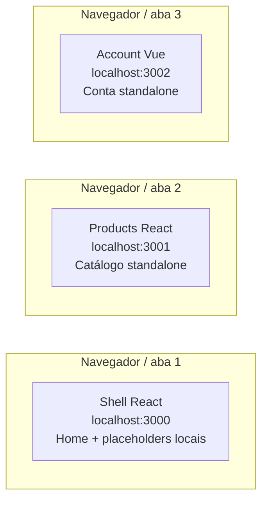

# Antes do Module Federation

Cada endereço abre uma aplicação completa e independente. Não existe seta entre os apps porque nenhum carrega código produzido pelo outro.

Os três processos podem ser iniciados pelo mesmo comando do workspace, mas essa conveniência operacional não cria composição em runtime.

