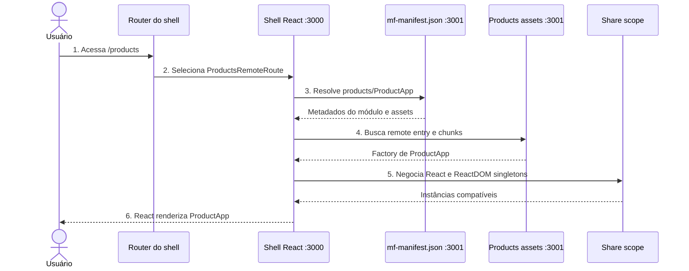

# Fluxo de Products em runtime

O shell conhece o identificador público do módulo, mas a implementação continua sendo entregue pelo servidor de Products.

Se o manifest ou os assets falharem, a Error Boundary troca apenas o conteúdo da rota por uma mensagem. O header, Home e Account pertencem ao shell e continuam utilizáveis.
