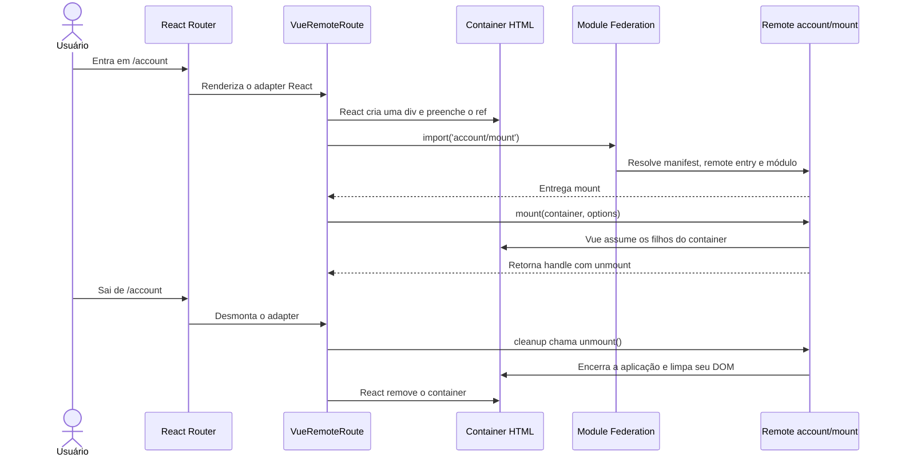

# Lifecycle do Vue dentro do host React

Se o import terminar depois que o adapter já tiver sido desmontado, o sinal de cancelamento impede a chamada de `mount`. React continua dono do container, e Vue continua dono apenas do conteúdo interno durante sua montagem.
