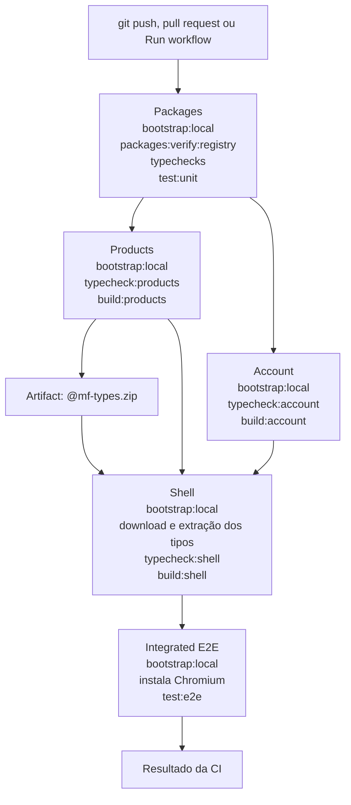
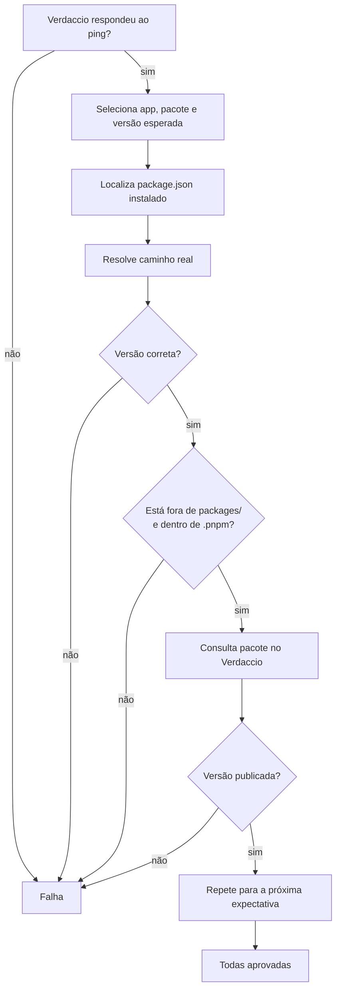

# Etapa 23 — Fluxo da CI e seus comandos

## Dependência entre jobs

`needs` controla as setas de dependência. Somente o artifact transporta um arquivo entre os filesystems isolados de Products e Shell.

## Preparação repetida por job

```mermaid
flowchart LR
  Checkout["checkout"] --> Tools["pnpm + Node + cache"]
  Tools --> Registry["registry:up"]
  Registry --> PackageInstall["packages:install"]
  PackageInstall --> PackageBuild["packages:build"]
  PackageBuild --> PackCheck["packages:pack:check"]
  PackCheck --> Publish["packages:publish:local"]
  Publish --> WorkspaceInstall["workspace:install:local-registry"]
  WorkspaceInstall --> JobCommands["comandos específicos do job"]
  JobCommands --> Cleanup["registry:down com always()"]
```

Cada job recebe uma máquina limpa, portanto repete essa preparação. O cache pode economizar downloads, mas não compartilha `node_modules`, processos nem o storage do Verdaccio.

## Verificação dos pacotes instalados

