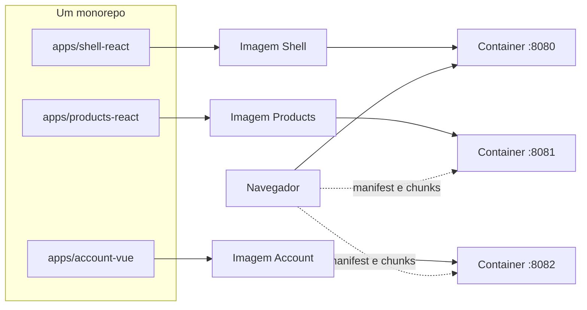
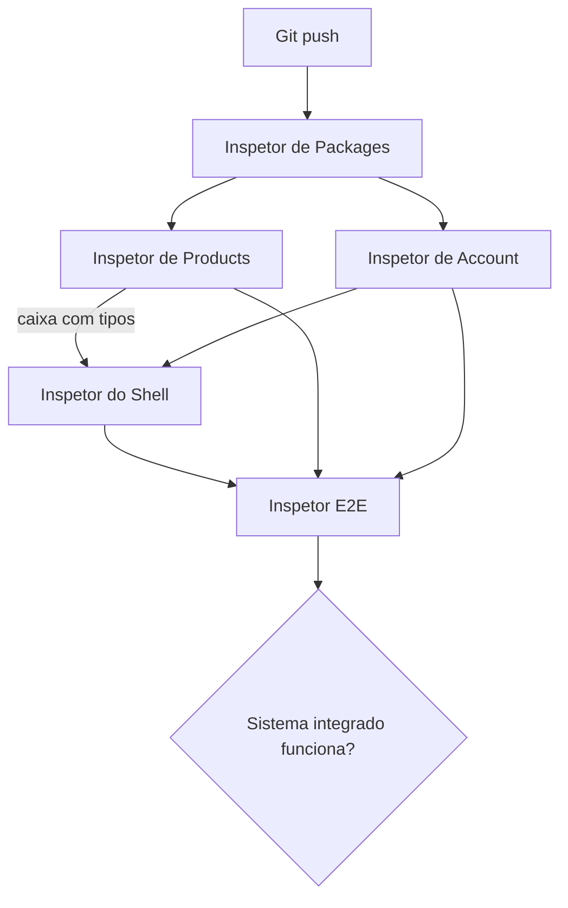
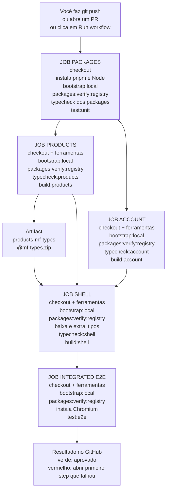
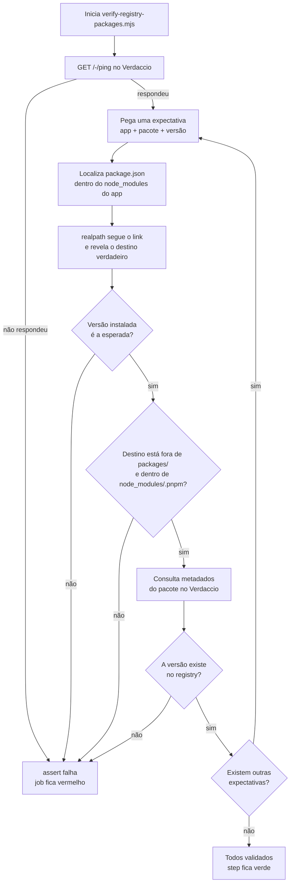

# Caderno do futuro e-book — Micro Frontends com Module Federation

Este arquivo preserva o aprendizado conceitual construído durante o laboratório. As lições numeradas registram cada implementação técnica; este caderno registra a narrativa didática, as analogias, as dúvidas importantes e as ideias que deverão aparecer no e-book final.

## Objetivo editorial

Produzir, ao final do laboratório, um guia que possa ser lido por alguém que não participou do treinamento e ainda não conhece micro frontends. O texto deve partir do problema, introduzir cada conceito somente quando ele se tornar necessário e conectar configuração, runtime, deploy e experiência do usuário.

O guia deverá:

- usar linguagem simples antes de apresentar o termo técnico;
- explicar o motivo antes da configuração;
- separar claramente desenvolvimento, build e runtime;
- usar analogias sem substituir a explicação técnica;
- mostrar fluxos e diagramas;
- incluir exemplos pequenos extraídos do laboratório;
- destacar erros comuns e decisões de arquitetura;
- terminar capítulos com perguntas, exercício e resposta curta de entrevista;
- deixar claro o que normalmente já existe em uma empresa e o que um desenvolvedor mantém no cotidiano.

## Diretriz visual obrigatória

O e-book final deve incorporar as ilustrações e os diagramas conceituais usados durante a conversa, redesenhados com identidade visual consistente e acompanhados de texto alternativo. Eles não devem ser tratados como decoração: cada figura precisa explicar uma relação que seria mais difícil compreender somente em prosa.

Usar `Manual_DeNode_Usuario.pdf` como referência de ritmo editorial e aplicar dois tipos de página:

- páginas especiais, como capa, abertura de parte, divisória de capítulo ou composição com imagem de fundo, devem ocupar 100% da largura e da altura do A4, sem as margens brancas do miolo;
- páginas comuns de conteúdo devem preservar margens confortáveis, cabeçalho, rodapé e paginação consistentes;
- screenshots, diagramas e figuras inseridos em uma página de conteúdo continuam dentro da área editorial e não viram full bleed automaticamente;
- imagens usadas como fundo de página devem preencher toda a página, sem faixas brancas, distorção ou margem padrão;
- textos em páginas full bleed precisam manter uma margem interna de segurança, mesmo que o fundo alcance todas as bordas;
- capa e divisórias não devem herdar cabeçalho, rodapé ou numeração visual do miolo.

Em resumo: o fundo pode ir até a borda; o conteúdo textual continua respeitando uma área segura.

Preservar especialmente:

- os três apps separados antes da federação;
- a relação producer → `exposes` → manifest → remote entry → chunks;
- a relação consumer → rota → `lazy` → `remotes` → módulo exposto;
- o fluxo completo de carregamento de `/products` em runtime;
- a diferença entre loading (`Suspense`), erro (Error Boundary) e sucesso;
- a negociação de React e ReactDOM no share scope;
- o fluxo `env` → URL escolhida → manifest;
- a comparação entre manifest, remote entry e assets;
- a separação entre componente, criação da aplicação e bootstrap/montagem;
- a comparação entre `pnpm`, `tsc`, Rsbuild e servidor de desenvolvimento;
- a evolução incremental do laboratório, do standalone à composição.

Além dos diagramas já versionados em `docs/diagrams`, reconstruir no e-book as ilustrações explicativas que apareceram somente na conversa. Antes de finalizar, revisar o histórico e este caderno para não perder nenhuma figura útil.

## Explicação central para preservar

> O shell registra o remote por uma URL configurável. Quando a rota é acessada, o runtime consulta o manifest, encontra os assets do módulo exposto, negocia as dependências compartilhadas e renderiza o componente. Loading e falhas ficam isolados na fronteira da rota.

Essa explicação deve aparecer no e-book depois que `producer`, `consumer`, `exposes`, `remotes` e manifest já tiverem sido apresentados separadamente.

## Receita humana e reproduzível

O e-book deve apresentar cada integração duas vezes: primeiro como uma história simples, que o leitor consegue visualizar, e depois como configuração técnica. A leitura precisa permitir que alguém reproduza o padrão sem tratar Module Federation como mágica.

### Começar com três projetos independentes

Usar uma explicação semelhante a:

> Pense em três projetos: Shell, Products e Account. Cada um abre sozinho, possui seu próprio servidor, sua própria porta e seu próprio build. Nesse momento eles sabem que os outros existem apenas porque nós, desenvolvedores, sabemos; tecnicamente ainda não existe composição.

```text
shell-react      http://localhost:3000
products-react   http://localhost:3001
account-vue      http://localhost:3002
```

O pnpm executa e organiza os três projetos, mas não coloca uma interface dentro da outra. Essa composição só começa quando um projeto publica uma superfície e outro projeto decide consumi-la.

### Transformar Products em algo consumível

Apresentar o raciocínio nesta ordem:

1. Products instala o plugin de Module Federation compatível com Rsbuild.
2. Products escolhe um nome federado estável: `products`.
3. Em `exposes`, cria um nome público para o componente.
4. Esse nome público aponta para o arquivo físico que existe somente dentro de Products.
5. O build gera manifest, remote entry e chunks carregáveis.

```typescript
pluginModuleFederation({
  name: 'products',
  exposes: {
    './ProductApp': './src/ProductApp.tsx',
  },
  manifest: true,
});
```

Explicar visualmente o mapa de nomes:

```text
Nome do remote       products
Nome público         ./ProductApp
Arquivo físico       ./src/ProductApp.tsx
Import do consumer   products/ProductApp
```

Preservar esta frase:

> `./ProductApp` não é uma pasta nova. É o nome público escolhido pelo producer. O valor `./src/ProductApp.tsx` é o endereço físico privado da implementação.

Depois do build, explicar os artefatos sem excesso de detalhes:

```text
mf-manifest.json  → catálogo que descreve o remote
remoteEntry.js    → entrada executável do container federado
chunks com hash   → arquivos que carregam o código real e o CSS
@mf-types.zip     → contrato TypeScript gerado para consumers
```

### Ensinar o shell a encontrar Products

Mostrar que o shell precisa de duas informações diferentes:

1. onde encontrar o remote;
2. qual módulo público deseja carregar.

```typescript
pluginModuleFederation({
  name: 'shell',
  remotes: {
    products: 'products@http://localhost:3001/mf-manifest.json',
  },
});
```

```typescript
const remoteModule = await import('products/ProductApp');
```

Traduzir o import em linguagem humana:

```text
products/ProductApp
    │         │
    │         └── módulo público ./ProductApp
    └──────────── alias products registrado no shell
```

> O shell não conhece `apps/products-react/src/ProductApp.tsx`. Ele conhece somente o alias `products`, a URL do manifest e o nome público `ProductApp`.

### Repetir o raciocínio com Vue, destacando a diferença

Account segue o mesmo processo de publicação, mas não expõe um componente Vue diretamente para React. Ele expõe um lifecycle neutro:

```typescript
pluginModuleFederation({
  name: 'account',
  exposes: {
    './mount': './src/mount.ts',
  },
  manifest: true,
});
```

Mapa equivalente:

```text
Nome do remote       account
Nome público         ./mount
Arquivo físico       ./src/mount.ts
Import do consumer   account/mount
```

No shell:

```typescript
const accountModule = await import('account/mount');

const handle = accountModule.mount(container, {
  source: 'shell-react',
  initialUserName: 'Denis',
});
```

Ao sair da rota:

```typescript
handle.unmount();
```

Preservar a comparação direta:

```text
React → React
O producer expõe um componente.
O shell renderiza esse componente na árvore React existente.

Vue → React
O producer expõe mount/unmount.
O shell fornece uma div e Vue controla o conteúdo interno.
```

### Checklist visual de reprodução

Cada capítulo prático do e-book deve terminar com um quadro de consulta rápida:

```text
NO PRODUCER
[ ] instalar e registrar o plugin
[ ] escolher o nome federado
[ ] declarar exposes: nome público → arquivo físico
[ ] gerar manifest
[ ] manter o modo standalone
[ ] conferir manifest, remote entry e chunks

NO CONSUMER
[ ] registrar alias → URL do manifest
[ ] importar alias/módulo-publicado
[ ] carregar de forma assíncrona
[ ] mostrar loading
[ ] isolar erros
[ ] respeitar o contrato e o lifecycle
```

Sempre incluir uma seção “onde cada coisa está” com links ou caminhos dos arquivos reais do laboratório. O objetivo é que o leitor consiga olhar o diagrama, comparar producer e consumer e reconstruir a integração sem decorar configuração solta.

## Linha de aprendizado construída

### 1. Repositório e workspace

- O monorepo reúne vários projetos no mesmo repositório, mas não transforma automaticamente esses projetos em micro frontends.
- `pnpm-workspace.yaml` informa quais pastas são pacotes do workspace.
- O `package.json` da raiz funciona como painel de comandos do laboratório.
- O `package.json` de cada app contém os comandos e dependências próprios daquele app.
- `pnpm --filter` seleciona qual pacote executará um script.
- Um script geral sem sufixo pode executar todos os apps; scripts como `dev:products` selecionam somente um.
- A raiz do monorepo não é um servidor. Ela organiza código, dependências e comandos.

### 2. Ferramentas que não devem ser confundidas

- `pnpm` instala dependências, administra o workspace e executa scripts.
- `tsc --noEmit` verifica tipos e não gera nem serve a aplicação.
- Rsbuild transforma os módulos e assets em arquivos executáveis pelo navegador.
- O servidor de desenvolvimento do Rsbuild é quem atende as portas locais.
- `dev`, `typecheck` e `build` são tarefas diferentes, embora possam ser combinadas por scripts da raiz.

### 3. Apps standalone antes da federação

- Shell React, Products React e Account Vue começaram como três SPAs completas e independentes.
- Ter três aplicações em portas ou deploys diferentes não significa que exista composição de micro frontends.
- Abrir outra URL é navegação entre documentos; carregar um remote é inserir código de outro build na mesma experiência.
- O estado do contador pertence inicialmente a Products, não ao shell nem a um estado global.
- Router só foi adicionado onde existiam rotas reais: o shell.

### 4. Componente raiz e bootstrap

- `ProductApp` contém a interface e o estado de Products; não deve chamar `createRoot`.
- O bootstrap React encontra um elemento HTML e chama `createRoot` uma única vez para a SPA standalone.
- No Vue, `Account.vue` é a interface, `createAccountApp()` cria a instância Vue e `.mount(rootElement)` decide onde ela será montada.
- Separar criação, interface e montagem prepara contratos reutilizáveis sem configurar antecipadamente a federação.
- Quando um componente React remoto entra no shell React, ele participa da raiz React já criada pelo shell; importar o bootstrap remoto criaria uma raiz indevida.

### 5. Producer e `exposes`

- Products virou producer quando passou a oferecer um módulo para outros builds.
- `exposes` define a superfície pública do producer.
- A chave `./ProductApp` é o nome público; `./src/ProductApp.tsx` é a implementação interna.
- A combinação pode ser entendida como um alias público, mas também representa um contrato de distribuição em runtime.
- Somente arquivos declarados em `exposes` fazem parte da API federada.
- O bootstrap não é exposto porque ele controla uma página standalone e chama `createRoot`.

### 6. Manifest, remote entry e assets

- `mf-manifest.json` é gerado pelo plugin; não é escrito manualmente.
- Depois do build, ele existe em `apps/products-react/dist/mf-manifest.json`.
- Durante o desenvolvimento, é servido em `http://localhost:3001/mf-manifest.json`.
- O manifest é um catálogo: descreve o container, módulos expostos, remote entry, chunks, CSS e dependências compartilhadas.
- O manifest não contém HTML pronto nem é o componente.
- `remoteEntry.js` é a entrada executável do container; os chunks contêm a implementação compilada.
- O `remoteEntry.js` pertence ao producer que oferece os módulos. No laboratório, ele é gerado pelo build de Products em `apps/products-react/dist/remoteEntry.js` e depois servido para o shell.
- Ele não é escrito manualmente, não fica no `src` e não é o próprio `ProductApp`. Sua função é inicializar o container, participar da negociação do share scope, localizar os módulos expostos e entregar a implementação solicitada ao consumer.
- Em uma arquitetura com Products, Account e Checkout como producers, cada remote normalmente gera e publica seu próprio `remoteEntry.js`.
- O shell consulta o manifest de cada producer, encontra seu remote entry e solicita o expose necessário. O shell pode também gerar artefatos federados por usar o plugin, mas só oferece módulos a terceiros quando declara `exposes`.
- O shell aponta para um manifest de endereço estável e não precisa conhecer nomes de chunks com hash, que podem mudar a cada build.

Frase curta para preservar:

> `remoteEntry.js` é a porta de entrada executável do projeto que compartilha módulos; ele pertence ao producer e permite que o consumer solicite os exposes desse container.

Analogia a preservar:

- manifest: catálogo da biblioteca;
- remote entry: bibliotecário que sabe localizar e entregar;
- chunk: o livro solicitado;
- `ProductApp`: o conteúdo que será usado.

### 7. Consumer e `remotes`

- O shell virou consumer ao registrar o remote `products`.
- Em `products@URL`, `products` é o nome real do container e a URL aponta para seu manifest.
- A chave `products` em `remotes` é o alias usado pelo shell.
- `import('products/ProductApp')` combina o alias do remote com o nome público definido em `exposes`.
- Esse import não procura um caminho local nem um pacote no `node_modules`; o runtime do Module Federation o resolve.
- O shell não copia `ProductApp` e o remote não entra antecipadamente no bundle inicial do shell.

### 8. Variável de ambiente da URL

- A variável `PRODUCTS_REMOTE_URL` escolhe onde o shell procurará o manifest.
- Sem a variável, o laboratório usa `http://localhost:3001/mf-manifest.json` como fallback explícito.
- Local, homologação e produção podem usar o mesmo código do shell com URLs diferentes.
- `.env.example` apenas documenta a variável; `.env` contém uma configuração local real e não é versionado.
- No modelo atual, a variável é lida quando o Rsbuild inicia ou gera o build; ela não altera dinamicamente um build estático já publicado.
- Um build de produção não deve manter `localhost`, pois esse endereço apontaria para o computador do visitante.

Frase curta para preservar:

> O `env` escolhe onde procurar. O manifest informa o que existe e onde estão os arquivos. O remote entry sabe entregar o módulo. Os chunks contêm o código real do componente.

### 9. Carregamento e isolamento de falhas

- `React.lazy` inicia uma importação assíncrona quando a parte correspondente da árvore é renderizada.
- `Suspense` trata espera, não erro; seu fallback aparece enquanto a Promise está pendente.
- Error Boundary trata falhas de carregamento ou renderização abaixo de sua fronteira.
- A fronteira foi colocada apenas ao redor da rota remota para que Products não derrube Home nem Account.
- A referência federada foi isolada em um chunk local lazy para que a operação que pode falhar aconteça dentro da fronteira protegida.

Analogia a preservar:

- `Suspense`: “a encomenda está a caminho”;
- Error Boundary: “não foi possível entregar a encomenda”;
- componente remoto renderizado: “a encomenda chegou”.

### 10. `shared` e share scope

- `shared` não expõe `ProductApp` e não substitui `exposes`.
- Cada app continua declarando React em suas próprias dependências porque também funciona standalone.
- Na composição, o share scope negocia a reutilização de dependências compatíveis.
- React e ReactDOM são singletons porque hooks, Context e reconciliação não devem atravessar instâncias incompatíveis na mesma árvore.
- `requiredVersion` registra a versão esperada por cada participante.
- `loaded-first` prioriza uma versão compatível já carregada e evita consultar Products antes de o shell montar Home.
- A indisponibilidade de Products só deve ser relevante quando sua rota realmente for acessada.

### 11. Tipos federados (`dts`)

- Arquivos `.d.ts` descrevem a superfície TypeScript sem carregar a implementação.
- Products gera um pacote de tipos para `ProductApp`.
- O shell baixa esses tipos para `@mf-types` e resolve `products/ProductApp` durante o typecheck.
- A pasta é cache gerado e não deve ser confundida com uma cópia da implementação.
- Tipos detectam incompatibilidades durante desenvolvimento e build, mas não garantem que o servidor remoto estará disponível em runtime.
- Error Boundary continua necessária mesmo quando todos os tipos estão corretos.

### 12. O cotidiano em uma vaga

- Em muitas empresas, shell, templates, pipeline, convenções de URL, Error Boundaries e estratégia de compartilhamento já existem.
- O trabalho frequente é manter o padrão, adicionar um novo remote, evoluir contratos, investigar falhas e coordenar deploys.
- Entender a montagem desde o zero permite diagnosticar problemas sem depender apenas de copiar configuração.
- O objetivo do laboratório não é decorar todas as opções, mas formar um modelo mental que possa ser aplicado à arquitetura específica de uma empresa.

### 13. Deploy independente não é HMR

- HMR pertence ao servidor de desenvolvimento e troca módulos enquanto o desenvolvedor trabalha, sem representar um deploy.
- No preview de produção, uma mudança só aparece depois de um novo build do app alterado.
- O shell pode permanecer com exatamente os mesmos arquivos enquanto Products publica um novo manifest e novos chunks na mesma origem.
- Manter estável a URL do manifest permite que o runtime descubra nomes de assets com hashes diferentes em cada versão.
- O `assetPrefix` do producer informa a origem pública de `remoteEntry.js` e dos chunks; sem ele, um manifest de produção pode apontar assets para a origem errada.
- Cache do manifest ou do remote entry pode atrasar a atualização mesmo quando o deploy foi concluído.
- Deploy independente não significa independência absoluta: nome do expose, exports, props, versões compartilhadas e comportamento ainda formam contratos entre equipes.

Frase curta para preservar:

> O shell não precisa ser reconstruído para cada mudança interna compatível do remote; ele precisa continuar conseguindo localizar o manifest e consumir o mesmo contrato público.

### 14. Artefatos de build, hashes e publicação

- Cada app gera seu próprio diretório `dist`; esse diretório é o produto do build e normalmente não é versionado no Git.
- O hash curto no nome de um chunk é um identificador de conteúdo criado pelo bundler para cache busting; não deve ser confundido com o SHA-256 completo calculado por `Get-FileHash`.
- O Module Federation não exige uma hierarquia universal de pastas no servidor. Exige que as URLs publicadas no manifest continuem válidas.
- Em produção, shell e remotes podem estar em domínios, buckets, serviços ou prefixos de pasta diferentes.
- A URL do manifest tende a permanecer estável, enquanto chunks com hash podem ser imutáveis e mudar de nome a cada conteúdo novo.
- `assetPrefix` é a base pública que o producer anuncia para localizar `remoteEntry.js`, chunks e CSS; não é o diretório local `dist`.
- A URL configurada em `remotes` responde “onde o shell encontra o manifest”; o `assetPrefix` responde “onde o remote diz que seus próprios assets estão”.
- Uma publicação segura envia primeiro os novos chunks e somente depois atualiza o manifest. Assets antigos devem permanecer disponíveis por algum tempo para páginas que ainda carregaram o manifest anterior.
- Mudar somente a implementação interna e preservar o contrato permite alterar os hashes do remote sem mudar os arquivos do shell.

### 15. Composição por rota e montagem em elemento HTML

- Rota e elemento de montagem não são alternativas excludentes. A rota pode decidir quando ativar um micro frontend e, dentro dela, o shell pode oferecer uma `<div>` como alvo de montagem.
- Products é React dentro de um shell React, então `ProductApp` entra diretamente na árvore React já existente; o remote não chama outro `createRoot`.
- Account será Vue dentro do host React. O shell não deve tratar um componente Vue como componente React; ele renderiza um elemento contêiner e entrega esse `HTMLElement` ao contrato remoto.
- O remote Vue implementa uma fronteira explícita de lifecycle: cria a aplicação com `createApp`, executa `mount(element)` e oferece `unmount()` para limpeza quando a rota sair.
- O shell é dono da posição e do elemento contêiner; o remote é dono do conteúdo renderizado dentro desse elemento.
- O mesmo contrato de montagem poderia ser usado fora de uma rota, por exemplo em um dashboard com vários widgets simultâneos. A rota é apenas uma forma de decidir quando montar.
- Um Web Component representa outra fronteira: ele pode aparecer como uma tag no template de React ou Vue, embora sua distribuição como pacote continue sendo diferente de um remote carregado por Module Federation.

### 16. Lifecycle neutro para atravessar frameworks

- Um Single File Component Vue não pode ser renderizado por React como se fosse um componente React: cada framework possui seu próprio formato de árvore virtual, runtime e lifecycle.
- O remote Account publica `account/mount`, e não o arquivo `.vue`. Sua superfície pública recebe um `HTMLElement` e dados simples e devolve um handle com `unmount()`.
- O elemento HTML é uma fronteira neutra: qualquer host capaz de fornecer DOM pode chamar o contrato sem precisar conhecer `createApp` nem importar Vue.
- `mount` cria a aplicação Vue, entrega ao Vue o conteúdo interno do container e registra aquela montagem. Uma segunda montagem no mesmo elemento falha cedo em vez de criar duas aplicações sobrepostas.
- `unmount` encerra a aplicação Vue, remove os efeitos e listeners gerenciados por ela e libera o container no registro. A operação é idempotente no mesmo handle.
- O bootstrap standalone não cria um caminho paralelo: ele encontra `#root` e chama exatamente o mesmo `mount` que um consumer usará no futuro.
- O `WeakMap` evita reter o container artificialmente, mas sua proteção contra duplicidade pertence à instância carregada desse módulo; não é um registro global entre bundles duplicados.
- O contrato atual só contempla opções iniciais. Atualização de props, eventos entre apps, prontidão assíncrona e tratamento padronizado de erros exigiriam evolução explícita do contrato.
- Compartilhar Vue como singleton negocia uma instância compatível quando houver participantes Vue. O shell React não passa a importar Vue por causa disso, e o remote ainda precisa carregar Vue quando funciona standalone.

Frase curta para preservar:

> O host oferece o terreno, um `HTMLElement`; o remote Vue constrói dentro dele e devolve a chave de desmontagem. O host não precisa saber como o Vue cria ou destrói sua interface.

### 17. Adapter React para um remote Vue

- O adapter `VueRemoteRoute` é um componente React, mas sua função não é converter Vue em React. Ele traduz o lifecycle da rota React para o contrato imperativo do remote.
- `useRef` guarda o container real que React criou. Vue recebe esse elemento somente depois que ele existe no DOM.
- `useEffect` inicia o import assíncrono e devolve o cleanup. Ao sair da rota, React executa esse cleanup e o handle remoto chama `app.unmount()`.
- React controla o elemento contêiner; Vue controla somente os filhos internos. O adapter não renderiza conteúdo React dentro da área entregue ao Vue.
- Um sinal `cancelled` resolve a corrida em que o usuário sai da rota antes de `import('account/mount')` terminar. Nesse caso, o resultado atrasado é ignorado e Vue não monta em uma tela que já deixou de existir.
- Loading e erro pertencem ao adapter React. A falha fica restrita a `/account`.
- O runtime pode manter em memória a falha de carregamento do manifest. Por isso, o retry simples desta etapa recarrega a URL atual: a nova página cria outra instância do runtime e tenta Account novamente. Retentativas sem reload exigiriam controlar o cache pela API ou pelo plugin oficial de retry.
- Em desenvolvimento, `StrictMode` pode executar setup, cleanup e setup do efeito para revelar problemas de lifecycle. Um adapter correto precisa tolerar essa sequência sem deixar duas aplicações montadas.

Frase curta para preservar:

> React não renderiza Vue: React decide quando existe um container, e o adapter traduz essa existência em `mount` e `unmount`.

### 18. Contrato compartilhado não é estado compartilhado

- Imagine que Shell, Products e Account trabalhavam com cópias separadas do mesmo formulário de acordo. Na etapa 11, essas cópias foram substituídas por um documento comum chamado `@mfe-lab/contracts`.
- O pacote contém formatos e nomes: opções de montagem, handle de desmontagem, papéis aceitos, nomes de eventos e formatos de payload. Ele não guarda o usuário atual, o contador atual nem qualquer store.
- `workspace:*` diz ao pnpm para ligar o consumidor ao pacote local do mesmo workspace. O consumidor encontra o pacote durante install/build, não consultando um manifest em runtime.
- O `package.json` do pacote aponta para `dist/index.js` e `dist/index.d.ts`; por isso o build do pacote acontece antes do typecheck e do build dos apps.
- Alterar um contrato não modifica um consumer já compilado. O consumer precisa receber a nova versão ou conteúdo, passar pelo typecheck e gerar outro build.
- TypeScript verifica código durante desenvolvimento e compilação, mas os tipos são apagados do JavaScript. Um payload vindo de evento, rede ou armazenamento pode estar errado em runtime; quando isso importa, é necessário validar dados de verdade.
- Nenhum type guard foi criado apenas para preencher a arquitetura. Guards só devem existir quando algum dado desconhecido for realmente validado, e então merecem testes unitários.

Comparação para consulta rápida:

```text
PACOTE DE CONTRATOS
install/build → tipos e constantes entram no consumidor → requer rebuild para atualizar

MODULE FEDERATION
runtime → shell consulta manifest → remote pode mudar sem rebuild do shell se preservar contrato
```

Frase curta para preservar:

> Compartilhar contrato é concordar sobre o formato da conversa; compartilhar estado seria dividir a informação viva que muda durante a conversa.

## Glossário inicial do e-book

- **Shell/host:** aplicação que controla a experiência principal e compõe partes externas.
- **Producer/remote:** build que publica módulos para outros apps.
- **Consumer:** build que solicita e usa módulos publicados.
- **Standalone:** app capaz de abrir e funcionar sozinho.
- **Composição:** renderização de partes de builds diferentes dentro da mesma experiência.
- **`exposes`:** superfície pública oferecida pelo producer.
- **`remotes`:** catálogo de producers conhecidos pelo consumer.
- **Manifest:** metadados para localizar container, módulos e assets.
- **Remote entry:** código executável que implementa o container federado.
- **Share scope:** espaço de negociação de dependências compartilhadas.
- **Singleton:** solicitação para reutilizar uma única instância compatível.
- **Bootstrap:** ponto que monta a aplicação standalone em um elemento HTML.
- **Contrato de montagem:** função ou API que separa a interface do local onde será montada.
- **Lifecycle:** operações explícitas que iniciam e encerram a presença de um micro frontend, como `mount` e `unmount`.
- **Error Boundary:** limite React que impede uma falha interna de derrubar uma área maior.
- **DTS:** declarações TypeScript que descrevem o contrato de um módulo.

## Fontes internas para o e-book

- `docs/lessons/01-esqueleto-contrato-trabalho.md`
- `docs/lessons/02-shell-react-standalone.md`
- `docs/lessons/03-products-react-standalone.md`
- `docs/lessons/04-account-vue-standalone.md`
- `docs/lessons/05-three-independent-apps.md`
- `docs/lessons/06-products-producer.md`
- `docs/lessons/07-shell-consumes-products.md`
- `docs/lessons/08-independent-remote-deploy.md`
- `docs/lessons/09-vue-lifecycle-remote.md`
- `docs/lessons/10-react-consumes-vue.md`
- `docs/lessons/11-build-time-contract-package.md`
- `docs/lessons/12-cross-mfe-events.md`
- `docs/lessons/13-design-tokens-package.md`
- `docs/lessons/14-react-ui-npm-package.md`
- `docs/diagrams/05-before-federation.md`
- `docs/diagrams/07-products-runtime-flow.md`
- `docs/diagrams/10-react-host-vue-lifecycle.md`
- `docs/experiments/01-remote-independent-update.md`

## Orientação para continuar registrando

A cada nova etapa, acrescentar aqui somente os conceitos e dúvidas que melhorarem a futura narrativa. A implementação completa permanece na lição numerada. No encerramento do laboratório, transformar este caderno e as lições em capítulos progressivos, revisar exemplos contra o código final e gerar o e-book em um formato solicitado pelo aluno.
## 19. Comunicação em runtime: os apps conversam sem dividir o estado

Pense novamente nos três projetos:

```text
shell-react       → mostra informações gerais no header
products-react    → é dono do contador do carrinho
account-vue       → é dono do nome e do papel
```

O shell não entra no Products para buscar seu `useState` e não entra no Vue para ler seu `ref`. Cada remote anuncia um fato usando um evento do navegador:

```text
Products: “o carrinho agora tem 2 itens” ──► cart-updated
Account:  “Denis agora é Operador”       ──► profile-updated
Shell:    escuta e atualiza somente o header
```

O pacote `@mfe-lab/contracts` funciona como o modelo do envelope: define o nome da mensagem e quais campos ela carrega. `CustomEvent` é o entregador em runtime. O estado continua dentro do MFE que o controla.

Frase para memorizar:

> O contrato diz como a mensagem deve ser; o Custom Event transporta a mensagem; o micro frontend de origem continua dono do dado.

### Receita pequena

No emissor React:

```typescript
window.dispatchEvent(
  new CustomEvent<CartUpdatedEventPayload>(LAB_EVENT_NAMES.cartUpdated, {
    detail: { totalItems },
  }),
);
```

No emissor Vue, a ideia é a mesma: mudou o `ref`, cria o `CustomEvent` e despacha no `window`.

No shell:

```typescript
useEffect(() => {
  function handleCartUpdated(event: CustomEvent<CartUpdatedEventPayload>) {
    setCartTotal(event.detail.totalItems);
  }

  window.addEventListener(LAB_EVENT_NAMES.cartUpdated, handleCartUpdated);

  return () => {
    window.removeEventListener(LAB_EVENT_NAMES.cartUpdated, handleCartUpdated);
  };
}, []);
```

O `return` continua sendo o segredo do cleanup: quando o componente que registrou o listener desmonta, React remove a inscrição. Sem isso, eventos podem ser tratados repetidamente após remontagens.

Custom Events são adequados para poucas notificações desacopladas na mesma página. URL é melhor para estado navegável; backend é melhor para dados duráveis e de negócio; props/callbacks são melhores quando há uma relação direta de montagem; um store compartilhado aumenta o acoplamento e só deve ser adotado com ownership claro.

### `window` é global em qual espaço?

Explicar com cuidado que `window` não é global entre todos os projetos, servidores ou usuários. Ele é o objeto global de uma página aberta no navegador.

Quando o shell carrega Products por Module Federation e monta Account dentro de um container, os três códigos executam no mesmo documento e enxergam o mesmo `window`:

```text
Página localhost:3000
│
├── Shell React
├── Products React carregado como remote
└── Account Vue montado em uma div
        │
        └── todos usam o mesmo window
```

Ao abrir Products sozinho em `localhost:3001`, surge outra página com outro `window`. Um evento disparado nessa aba não chega automaticamente ao shell aberto em `localhost:3000`.

```text
Aba localhost:3000 → window A
Aba localhost:3001 → window B

evento no window B ≠ evento recebido no window A
```

Essa distinção evita a falsa impressão de que Custom Events atravessam deploys, processos, abas ou rede.

### `dispatchEvent` em linguagem humana

`dispatch` pode ser lido como “disparar”, “enviar” ou “publicar agora”. Ele não executa outra aplicação diretamente. O navegador procura os listeners registrados para aquele nome e chama seus handlers.

```text
dispatchEvent = tocar a campainha
listener      = quem está ouvindo a campainha
handler       = o que a pessoa faz quando escuta
detail        = o conteúdo entregue com o aviso
```

Fluxo completo do carrinho:

```text
1. A pessoa clica em Adicionar
2. Products altera seu useState de 0 para 1
3. Products dispara cart-updated { totalItems: 1 }
4. window localiza os listeners de cart-updated
5. o navegador chama handleCartUpdated(event)
6. o shell lê event.detail.totalItems
7. setCartTotal(1) agenda uma nova renderização
8. o header passa a mostrar Carrinho: 1
```

### Não é um Event Bus do Vue

Registrar a reação do aluno: mesmo um desenvolvedor experiente pode nunca ter visto `window` usado dessa forma, porque frameworks normalmente conduzem a props, Context, stores e APIs próprias. A API nativa já aparece em eventos como `resize`, `scroll`, `storage` e `keydown`; a novidade didática é criar um nome de evento com `CustomEvent` e transportar dados em `detail`.

No Vue 2 era comum criar um Event Bus baseado em uma instância Vue e usar `$emit` e `$on`. Aqui o Vue apenas percebe a alteração de seu `ref` e chama uma API do navegador. React, Vue, Angular, Svelte ou JavaScript puro podem entender o mesmo evento.

Conceitualmente, usar `window` dessa maneira tem publicação e assinatura, portanto lembra um Event Bus pequeno. Tecnicamente, não criamos uma classe, singleton próprio ou biblioteca com `publish` e `subscribe`: usamos `dispatchEvent`, `addEventListener` e `removeEventListener` diretamente.

Limitações que precisam aparecer no e-book:

- funciona apenas no mesmo documento;
- não persiste nem guarda histórico;
- não entrega novamente para quem começou a ouvir depois;
- os listeners são executados de forma síncrona durante o dispatch;
- excesso de eventos cria uma “rádio global” difícil de rastrear;
- nomes, payloads, ownership e cleanup precisam ser explícitos;
- TypeScript não valida sozinho o payload em runtime.

### Como ler a função `App` do shell

Separar visualmente as três responsabilidades introduzidas na etapa 12:

```text
useState
└── guarda a última fotografia recebida para apresentar no header

useEffect com []
├── registra os listeners uma vez quando App monta
└── devolve o cleanup executado quando App desmonta

JSX
└── lê cartTotal e profile e redesenha o header
```

Ressaltar que trocar `/products` por `/account` não desmonta normalmente o `App` do shell. Somente o conteúdo escolhido pelo router muda. Por isso os listeners do shell continuam ativos durante a navegação. O cleanup do `App` acontece quando o próprio shell desmonta, enquanto o cleanup de `VueRemoteRoute` acontece ao sair da rota Account.

Products continua sendo a fonte da verdade do contador, e Account continua sendo a fonte da verdade do perfil. `cartTotal` e `profile` no shell são projeções para leitura, sem comandos para alterar o estado dos remotes.

### Decidir que será MFE não significa usar `window` em tudo

Para um projeto novo, ensinar esta ordem de perguntas:

```text
1. Qual é o domínio de negócio?
2. Qual equipe é responsável por ele?
3. Existe necessidade real de deploy independente?
4. Ele funcionará standalone, dentro de um shell ou nos dois modos?
5. Qual superfície pública será exposta?
6. Quais dados entram no MFE?
7. Quais acontecimentos saem dele?
8. Qual canal é adequado para cada comunicação?
```

Micro frontend não deve ser escolhido apenas para separar pastas. A autonomia de equipe, ownership de domínio e necessidade de entrega independente precisam compensar custos como contratos, observabilidade, versionamento, resiliência e coordenação visual.

Depois de escolher a fronteira, avaliar o canal:

```text
Shell → remote diretamente relacionado     → props ou opções de mount
Remote → shell com notificação pequena     → callback ou Custom Event
Estado navegável e compartilhável          → URL
Dado durável, multiusuário ou de negócio   → backend
Estado muito coordenado na mesma página    → store, com ownership explícito
```

Exemplo humano para o futuro e-book:

```text
Novo MFE: checkout

Entradas:
- identificador do carrinho
- moeda
- usuário autenticado

Saídas:
- checkout iniciado
- pagamento concluído
- checkout cancelado

Dados duráveis:
- carrinho
- pagamento
- pedido
→ pertencem ao backend, não ao window
```

Frase de fechamento:

> Ao criar um MFE, planeje cedo a fronteira e os contratos. Use `window` apenas quando Custom Events forem o canal adequado — não como comunicação padrão para tudo.

## 20. Design tokens: compartilhar decisões visuais sem compartilhar componentes

Apresentar primeiro o problema humano:

```text
Shell escreve:   border: 1px solid #cbd5e1
Products copia:  border: 1px solid #cbd5e1
Account copia:   border: 1px solid #cbd5e1
```

As interfaces parecem consistentes, mas não existe uma fonte comum. Se a marca mudar a borda, três equipes precisam encontrar o mesmo valor copiado.

Com tokens:

```text
@mfe-lab/design-tokens
└── --mfe-color-border: #cbd5e1
       ├── Shell usa no CSS Module
       ├── Products usa no CSS Module
       └── Account usa no style scoped
```

Frase para memorizar:

> Token compartilha uma decisão visual; componente compartilha estrutura e comportamento.

React e Vue não precisam entender um ao outro. Ambos geram elementos HTML, e o navegador resolve `var(--mfe-color-border)`. Por isso cores, espaçamentos, raios e tipografia podem formar um pacote neutro.

Reforçar a separação:

```text
GLOBAL POR INTENÇÃO
:root e propriedades --mfe-*

LOCAL POR OWNERSHIP
classes, seletores, layout e comportamento de cada app
```

O pacote é ligado por `workspace:*` e incluído durante o build de cada consumidor. Ele não tem manifest nem remote entry. Alterar seu fonte não muda um app já compilado; o consumidor precisa adotar a versão, rebuildar e fazer deploy.

O e-book deve mostrar o erro encontrado no laboratório: o primeiro build não gerou o CSS porque o bundler eliminou um import sem exportação observável. Marcar `**/*.css` como `sideEffects` explicou, na prática, que importar CSS causa um efeito no documento mesmo sem retornar um valor JavaScript. `output.target: 'web'` também é necessário porque Rslib tem alvo Node por padrão.

Alertar sobre versões divergentes. Como `:root` é global, dois remotes podem trazer versões diferentes do mesmo nome e a cascata decidir qual valor vence pela ordem de carregamento. Versionamento ajuda adoção e rollback, mas não elimina a necessidade de compatibilidade e coordenação.

## 21. Biblioteca React: reutilização não é micro frontend

Usar a seguinte evolução didática:

```text
design-tokens
└── compartilha valores visuais entre qualquer framework

ui-react
└── compartilha pequenos componentes somente entre consumidores React

ProductApp remote
└── entrega um domínio e uma interface em runtime
```

`LabButton` e `AppBoundaryLabel` entram no shell e em Products durante o build de cada consumidor. Eles não possuem servidor, manifest ou deploy próprio. Por isso uma biblioteca de componentes não é automaticamente um micro frontend.

### Analogia do motor

`peerDependencies` pode ser explicado assim:

> A biblioteca é uma peça feita para um modelo de motor, mas não leva outro motor dentro da caixa. O aplicativo informa qual React compatível está instalado e a peça usa esse React.

Se `ui-react` levasse React dentro de seu bundle, o shell poderia terminar com React A e a biblioteca com React B. Além do peso, Hooks, Context e identidade da árvore poderiam deixar de concordar.

Separar as categorias:

```text
dependencies
└── o pacote precisa disso para funcionar quando distribuído

devDependencies
└── o autor precisa disso para desenvolver, tipar e construir

peerDependencies
└── o consumidor precisa fornecer uma versão compatível
```

O build deve ser mostrado no e-book: o pequeno `dist/index.js` contém import de `react/jsx-runtime` e não uma cópia da implementação React. Essa evidência torna “React externo” concreto.

### Build time versus runtime novamente

```text
Atualizar ui-react
→ publicar/ligar nova versão
→ instalar no consumidor
→ rebuildar consumidor
→ fazer deploy do consumidor

Atualizar ProductApp remote preservando contrato
→ rebuildar Products
→ fazer deploy de Products
→ shell consulta o manifest em runtime
```

Frase para memorizar:

> `ui-react` compartilha peças no build; `ProductApp` entrega uma aplicação de domínio no runtime.

Vue não usa naturalmente `LabButton` porque um componente React é entendido pelo reconciliador React, enquanto o template Vue é entendido pelo lifecycle e renderer Vue. Compartilhar tokens é neutro; compartilhar componentes de framework exige compatibilidade, wrapper ou outra fronteira web.

### `workspace:*`, registry e fotografias com tags

Deixar claro que `workspace:*` não é uma solução apenas didática. Ele é comum quando aplicações e bibliotecas são desenvolvidas no mesmo monorepo. O link local existe durante instalação e build; o navegador em produção recebe somente os artefatos compilados.

```text
Mesmo monorepo e mesma esteira
→ workspace:* costuma ser adequado

Repositórios, equipes ou ciclos de versão independentes
→ registry privado costuma ser adequado
```

O Verdaccio demonstrará o segundo fluxo sem publicar nada no npm público. Os apps deixarão de resolver os pacotes diretamente pelo workspace e instalarão versões publicadas no registry local. Isso não substitui Module Federation: Verdaccio distribui pacotes de build time; o manifest distribui remotes em runtime.

Evitar deixar alguns apps usando o registry e outros usando links locais apenas para demonstrar os dois modelos. Uma arquitetura híbrida tornaria os experimentos de atualização difíceis de interpretar. Em vez de duplicar projetos, preservar fotografias importantes com commits e tags Git.

Analogia para o e-book:

> Branch é uma estrada que continua sendo construída. Tag é uma placa fixa indicando um ponto daquela estrada.

Exemplo visual:

```text
A ── B ── C ── D
     ↑         ↑
etapa-14     main
workspace   continua avançando
```

Comandos a explicar:

```bash
git tag etapa-14-workspace-packages
git show etapa-14-workspace-packages
git switch --detach etapa-14-workspace-packages
git switch main
```

Assim, o leitor poderá consultar e executar o estado com `workspace:*` pelo commit marcado, enquanto a linha principal evolui posteriormente para o Verdaccio.

## 22. Web Component: uma tag neutra entre React e Vue

Começar com o problema humano deixado pela biblioteca anterior:

```text
LabButton React
├── Shell React usa
├── Products React usa
└── Account Vue não entende
```

Em seguida mostrar a alternativa desta etapa:

```text
<lab-status-chip>
├── Shell React escreve a tag
├── Account Vue escreve a tag
└── navegador cria e controla o elemento
```

Frase para memorizar:

> React e Vue não renderizam um ao outro; ambos sabem colocar uma tag no DOM, e o navegador sabe executar um Custom Element registrado.

Usar a analogia de um aparelho com tomada padrão. `LabButton` possui um encaixe React. `lab-status-chip` usa o encaixe da própria plataforma web. Isso aumenta o alcance, mas não significa que Web Components substituem todos os componentes específicos de framework.

Mostrar o registro idempotente como uma regra global do navegador:

```ts
if (!customElements.get('lab-status-chip')) {
  customElements.define('lab-status-chip', LabStatusChipElement);
}
```

O shell e o remote Vue podem carregar cópias do pacote na mesma página. O registry é global, portanto a consulta impede uma segunda definição do mesmo nome.

### Shadow DOM sem misticismo

```text
<lab-status-chip>
└── #shadow-root
    ├── style
    └── span.chip
```

Seletores ficam contidos, mas variáveis CSS são herdadas pelo host e podem ser consumidas internamente:

```css
color: var(--mfe-color-text, #0f172a);
```

Explicar que isso combina duas propriedades úteis: isolamento de estrutura/seletores e tematização por contrato. Também destacar que não é isolamento absoluto; eventos, propriedades herdáveis e APIs globais ainda precisam de decisões conscientes.

### Tipos sem transformar o pacote em React

O módulo principal expõe tipos DOM neutros. Uma entrada opcional `@mfe-lab/ui-web/react` ensina ao JSX quais atributos a tag aceita, mas seu JavaScript é vazio e não executa React. Para Vue, a configuração `isCustomElement` evita que o compilador procure um componente Vue inexistente.

### Build time continua sendo build time

```text
ui-web nova versão
→ instalar/resolver no consumidor
→ rebuildar Shell e/ou Account
→ publicar os consumidores
```

Não há manifest, remote entry ou servidor para `ui-web`. Ser framework-agnostic não é o mesmo que possuir deploy independente.

Fechar comparando as três camadas:

```text
design-tokens → valores visuais neutros
ui-react      → componentes com melhor DX para React
ui-web        → componente nativo atravessando frameworks
remotes       → aplicações/domínios carregados em runtime
```

### O significado concreto de `workspace:*`

Explicar que `workspace:*` não significa “qualquer versão da internet”. O prefixo obriga o pnpm a localizar um pacote com aquele nome dentro do workspace e criar uma ligação local. O `*` aceita a versão atualmente declarada pelo pacote encontrado.

```text
apps/shell-react
└── @mfe-lab/ui-web: workspace:*
              │
              └── ligação local → packages/ui-web
```

Mesmo ligado localmente, o consumidor respeita `package.json` e `exports`. Como `ui-web` aponta para `dist`, a biblioteca precisa ser construída antes do app. Na publicação, o protocolo workspace é convertido para uma versão publicável; os consumidores externos nunca recebem `workspace:*` dentro do tarball final.

### Por que existe um `export {}` vazio

Deixar explícito que `export {}` não exporta um objeto vazio. Ele marca um arquivo como módulo TypeScript sem criar valor de runtime. Na entrada de tipos React, sua função é evidenciar que o arquivo existe para ampliar `React.JSX.IntrinsicElements` sem poluir o escopo global como um script comum.

Neste caso, `import type` já tornaria o arquivo um módulo, então `export {}` é redundante do ponto de vista técnico, mas serve como marcador explícito. O artefato `react.js` gerado com zero bytes comprova que a entrada influencia a checagem de tipos, não o navegador.

### Por que o código nativo parece mais “raiz”

Comparar:

```text
React/Vue
→ template declarativo, atualização e lifecycle abstraídos

Custom Element nativo
→ HTMLElement, attachShadow, createElement,
  observedAttributes e customElements.define explícitos
```

O laboratório evita Lit de propósito para revelar as primitivas da plataforma. Web Components são usados em design systems, widgets, integrações entre frameworks e migrações, mas componentes complexos frequentemente usam Lit, Stencil, FAST ou wrappers específicos para reduzir boilerplate e melhorar a experiência de desenvolvimento.

Evitar prometer que “funciona para tudo”. A tag atravessa frameworks, mas formulários, SSR, eventos complexos, objetos e ergonomia de cada framework ainda podem exigir adapters.

## 23. Do `workspace:*` ao pacote publicado

Abrir com a continuação direta da analogia dos três projetos:

```text
Antes
Shell ── link local ──> packages/ui-react/src/dist

Agora
packages/ui-react
  ── build ──> dist
  ── pack ───> ui-react-1.0.0.tgz
  ── publish ─> Verdaccio
  ── install ─> Shell
```

Frase humana para memorizar:

> `workspace:*` é pegar a ferramenta diretamente na oficina ao lado. Publicar é embalar uma versão, colocá-la no estoque com etiqueta e fazer o app pedir exatamente aquela caixa.

Explicar que o Verdaccio não hospeda os micro frontends. Ele guarda pacotes usados no install/build. Quem hospeda o código federado em runtime continua sendo o servidor de cada remote, por meio de manifest, remote entry e chunks.

```text
Verdaccio / npm privado
→ distribui contracts, tokens e componentes
→ entra antes do build do consumidor

Module Federation
→ distribui ProductApp e account/mount
→ entra no navegador, em runtime
```

### O mesmo repositório não significa a mesma fonte

Mostrar que `packages/ui-react/src` pode continuar ao lado do Shell no monorepo, mas `linkWorkspacePackages: false` e a dependência exata `1.0.0` evitam o atalho local:

```text
apps/shell-react/package.json
└── @mfe-lab/ui-react: 1.0.0
        ↓ .npmrc escolhe registry por escopo
http://127.0.0.1:4873
        ↓ baixa tarball
node_modules/.pnpm/@mfe-lab+ui-react@1.0.0...
```

Editar a fonte local não muda o app. É necessário gerar uma nova versão, publicar, instalar e rebuildar o consumidor. Isso cria uma fronteira parecida com a de repositórios separados sem perder a conveniência do monorepo.

### O que foi realmente publicado

O registry recebe um `.tgz` contendo `package.json` e os arquivos permitidos de `dist`; não recebe magicamente todo o projeto. `pnpm pack --dry-run` permite abrir a lista da caixa antes do envio.

Destacar também a conversão do protocolo interno:

```text
fonte de ui-react:       design-tokens = workspace:*
manifest no tarball:     design-tokens = 1.0.0
```

O primeiro é uma garantia de desenvolvimento no workspace. O segundo é uma dependência compreensível por qualquer consumidor do registry.

### O lockfile como comprovante

Comparar visualmente:

```yaml
# antes: fonte ligada
specifier: workspace:*
version: link:../../packages/ui-react

# depois: artefato versionado
specifier: 1.0.0
version: 1.0.0
```

O lockfile registra a decisão reprodutível e a integridade do conteúdo. O metadata do Verdaccio mostra ainda a URL do tarball. `pnpm why` responde qual consumidor pediu aquela versão.

### Por que existe `bootstrap:local`

Num registry vazio, os apps pedem pacotes que ainda não foram publicados. Portanto, o fluxo limpo precisa respeitar a ordem:

```text
subir Verdaccio
→ instalar toolchain apenas dos pacotes
→ buildar
→ inspecionar tarballs
→ publicar dependências em ordem
→ instalar os apps
→ executar checks
```

O pnpm 11 normalmente verifica e instala dependências antes de rodar scripts. Para não deixar essa conveniência tentar instalar os apps cedo demais, o laboratório define `verifyDepsBeforeRun: false` e deixa o próprio bootstrap controlar a sequência. Isso não desliga a validação do lockfile nos comandos `install --frozen-lockfile`; apenas remove a instalação implícita anterior ao script.

O nome do container deve aparecer nas ilustrações e troubleshooting: `microfrontends-lab-verdaccio`. Isso ajuda o leitor a reconhecer que aquele container é a prateleira local de pacotes do laboratório, não um servidor do Shell.

## 24. A comparação central: caixa versionada versus restaurante ao vivo

Usar a etapa 17 como o capítulo que une tudo. Começar com uma única tela mostrando versões diferentes:

```text
SHELL · UI React 1.0.0
└── PRODUCTS · UI React 1.1.0 · products-v3
```

Analogia humana:

> Uma biblioteca npm é um ingrediente embalado que o restaurante comprou antes de abrir. Um remote é um balcão parceiro servindo parte do pedido enquanto o cliente está no salão.

Para a biblioteca:

```text
ui-react@1.1.0 foi colocado na prateleira
≠
todos os apps trocaram automaticamente sua caixa 1.0.0
```

Publicar apenas disponibiliza. Cada consumidor escolhe quando adotar, atualiza seu `package.json`, instala, builda e faz deploy. Por isso Shell pôde permanecer em `1.0.0` enquanto Products adotou `1.1.0`.

Para o remote:

```text
Shell buildado conhece a placa:
http://localhost:3001/mf-manifest.json

Products troca os pratos/chunks atrás da mesma placa
→ no próximo carregamento, Shell encontra products-v3
```

Destacar o trade-off sem vender uma solução como universalmente superior:

```text
Pacote npm
+ versão e rollback explícitos
+ falha do registry não afeta usuário após deploy
- adoção exige rebuild/redeploy do consumidor

Module Federation
+ remote atualiza sem rebuild do host
+ autonomia de release do domínio
- disponibilidade e contrato importam em runtime
- cache e observabilidade ficam mais importantes
```

Frase para entrevista:

> Publicação não é adoção. Um pacote novo só chega após o consumidor atualizar e rebuildar; um remote novo pode chegar no próximo carregamento pela mesma URL, desde que o contrato continue compatível.

## 25. A mesa de negociação do `shared`

Usar a analogia de uma sala com uma mesa chamada `default`:

```text
Share scope "default"
├── Shell oferece React 19.2.8
├── Products oferece React 19.2.8
├── ambos pedem singleton
└── runtime escolhe a instância reutilizada
```

Frase humana:

> `shared` não envia a feature de um app para outro; ele cria uma mesa onde os containers negociam quem fornece uma dependência comum.

Explicar os três conceitos separadamente:

```text
shared          → esta dependência participa da mesa
singleton       → queremos uma única instância nesse escopo
requiredVersion → esta é a versão que meu código espera
```

Destacar que singleton não significa “sempre vai funcionar”. Se todos forem obrigados a usar uma única ferramenta incompatível, continua existindo problema; apenas não existem duas ferramentas.

### Subpaths também entram pela porta

Mostrar imports reais:

```ts
import { jsx } from 'react/jsx-runtime';
import { createRoot } from 'react-dom/client';
```

Compartilhar apenas os nomes raiz não deve esconder que subpaths são módulos solicitados separadamente. A configuração com `react/` e `react-dom/` intercepta a família de imports e o manifest mostra as chaves finais negociadas.

### Por que UI React continua fora

Retomar a tela da etapa anterior:

```text
Shell    → ui-react 1.0.0
Products → ui-react 1.1.0
```

Essa diferença é intencional e saudável para o experimento. Colocar `ui-react` em `shared` poderia fazer o runtime escolher uma versão para ambos, mudando o código efetivamente testado por uma equipe. Compartilhar tudo economiza bytes às custas de autonomia e previsibilidade.

### Painel por contrato, não por espionagem

O painel técnico importa `products/technicalInfo` e `account/technicalInfo`, exposes públicos pequenos. Não acessa globals ou caches privados do Module Federation. Usar a analogia de cada time entregar um crachá com suas informações, em vez de o Shell vasculhar a mochila interna dos remotes.

Mostrar o painel apenas em desenvolvimento e registrar suas linhas como uma ilustração futura:

```text
React Shell ............. 19.2.8
React Products .......... 19.2.8
Products usa React Shell  sim
Vue Account ............. 3.5.42
Remote Products ......... products-v3
Remote Account .......... account-v1
UI React Shell .......... 1.0.0
UI React Products ....... 1.1.0
Manifests ............... :3001 / :3002
```

Explicar que duas versões iguais na tela ainda poderiam vir de duas cópias distintas. Para tornar a reutilização concreta sem ler internals, Products entrega uma referência pública a `useState` e o Shell a compara com a sua usando `===`. O resultado `sim` significa que ambas as fronteiras receberam a mesma identidade de função naquela execução.

## 26. Quando o restaurante parceiro fecha: resiliência em runtime

Retomar a analogia do restaurante ao vivo:

> O Shell continua sendo o salão e o cardápio principal. Products e Account são cozinhas parceiras. Se uma cozinha ficar indisponível, o salão não deve apagar as luzes nem expulsar todo mundo; apenas aquela parte do pedido precisa mostrar uma alternativa.

Mostrar as fronteiras como caixas independentes:

```text
SHELL
├── header e navegação ........ continuam vivos
├── Home ...................... continua local
├── /products
│   ├── loading
│   ├── falha ao buscar ....... fallback Products
│   └── falha ao renderizar ... fallback Products
└── /account
    ├── loading do import
    ├── falha ao importar ..... fallback Account
    ├── falha no mount ........ fallback Account
    └── saída da rota ......... unmount + cleanup
```

Frase humana para fixação:

> Import falhou significa “a encomenda nem chegou”. Render ou mount falhou significa “a caixa chegou, mas quebrou quando tentamos usar”.

### Retry que faz alguma coisa de verdade

Um botão que apenas troca `hasError` para `false` pode renderizar novamente, mas não garante nova busca de um módulo cujo erro ficou guardado. No laboratório:

```text
erro de renderização → limpar a Error Boundary e tentar renderizar de novo
erro de import → reload da rota e nova tentativa do runtime
```

Explicar que reload completo não é a única solução possível, mas é a mais transparente neste estágio. Uma solução granular exigiria APIs de runtime, invalidação de cache, limites de tentativa e métricas.

### O cache pode contar uma história atrasada

Registrar a descoberta real do laboratório: desligamos uma origem já acessada, mas a tela ainda conseguiu carregar porque manifest e chunks estavam em cache. Ao usar uma URL inédita, a falha apareceu.

```text
servidor desligado agora
  + recurso já guardado no navegador
  = a tela ainda pode funcionar por algum tempo
```

Isso prepara o capítulo futuro sobre CDN: manifest costuma precisar de revalidação curta; chunks com hash podem ter cache longo.

### O guarda da troca rápida

Usar uma ilustração temporal:

```text
t0 entra em /account → import começa
t1 sai para Home      → cleanup marca cancelled = true
t2 import termina     → vê cancelled e não chama mount
```

Sem essa verificação, Vue poderia tentar montar num container removido, atualizar estado de um adapter desmontado ou deixar recursos órfãos.

### A configuração também precisa ser observável

O painel revelou um bug: o Shell mostrava sempre os fallbacks 3001/3002 mesmo quando a variável era passada pelo terminal. A precedência correta ficou:

```text
process.env → arquivo .env → fallback localhost
```

Usar isso para ensinar que observabilidade não é somente registrar erros; também é conseguir responder “qual URL este build está realmente usando?”.

Frase para entrevista:

> Eu isolo loading, falha de import e falha de renderização ou montagem na fronteira de cada remote. O fallback pertence ao host, o cleanup respeita o lifecycle do framework remoto, e Retry, cache e logs são tratados como decisões operacionais, não apenas visuais.

## 27. Três apartamentos no mesmo terreno: isolamento de CSS

Começar pelo resultado real do experimento:

```text
antes de abrir Products
Home → 32px, cor normal

Products carrega uma regra global .title

depois de voltar para Home
Home → 48px, vermelho
```

Analogia humana:

> Module Federation trouxe três apartamentos para o mesmo terreno, mas o CSS global é como um alto-falante no pátio: qualquer regra anunciada ali pode ser ouvida por todos. Estar em outro projeto ou outro deploy não cria paredes CSS.

Mostrar as três soluções lado a lado:

```text
CSS Modules
.title → classe renomeada no build
boa escolha para Shell e Products React

Vue scoped
.title → .title[data-v-xyz]
seletor reescrito, mas ainda no mesmo DOM

Shadow DOM
.chip vive em outra árvore de estilos
barreira estrutural do Web Component
```

Destacar que nenhuma é “isolamento mágico”:

- CSS Modules não bloqueia herança, `body`, `:root` ou regras globais explícitas;
- Vue scoped ainda pode ser atingido por CSS global externo e possui `:deep`/`:global`;
- Shadow DOM ainda recebe custom properties, fontes e outras propriedades herdáveis pelo host.

### Ownership visível

Incluir uma ilustração do DOM:

```html
<div data-mfe-owner="shell-react">
  <main data-mfe-owner="products-react">...</main>
  <main data-mfe-owner="account-vue">...</main>
</div>
```

Na execução real as rotas mostram um remote por vez, mas a imagem ajuda a ensinar a hierarquia de ownership. O atributo serve para debug; ele não cria isolamento sozinho.

### Quem manda no body

Frase curta:

> O Shell é dono do documento, do `body`, do reset e da fonte global. Os remotes herdam o ambiente e estilizam somente suas fronteiras.

Design tokens permanecem globais por intenção. Isso permite consistência entre CSS Modules, scoped e Shadow DOM, mas versões divergentes ainda podem disputar o mesmo nome pela cascata.

### Quando uma classe global é necessária

Usar namespace explícito, como a biblioteca:

```css
.mfe-lab-ui-button { ... }
```

Explicar que prefixo reduz probabilidade de colisão, mas continua sendo convenção. A regra mais segura é manter estilos de feature locais e reservar o global para contratos deliberados.

Frase para entrevista:

> Module Federation compõe módulos, não cria uma sandbox de CSS. Eu escolho isolamento no producer, mantenho o body no host, uso tokens globais por contrato e torno as fronteiras observáveis no DOM.

## 28. Testar o prédio montado, não apenas cada apartamento

Pense novamente nos três projetos: Shell, Products e Account. Um teste de Products aberto sozinho na porta 3001 responde “a loja funciona?”. Ele não responde “o Shell encontrou a loja, carregou seu código de outro servidor e ouviu seu evento?”. Para provar micro frontends, parte da suíte precisa entrar pela porta 3000, como o usuário real.

```text
Teste isolado
Products:3001 → botão altera contador local

Teste de composição
Shell:3000/products
  → manifest em Products:3001
  → ProductApp remoto aparece
  → clique publica Custom Event
  → Shell atualiza Carrinho: 1
```

Vitest funciona como uma inspeção de uma peça na bancada: rápida e específica. Playwright funciona como alguém caminhando pelo prédio pronto: entra pela recepção, visita os apartamentos e confirma que portas, avisos e comunicação funcionam juntos.

O teste de Account entra, sai e entra novamente porque lifecycle é parte do contrato. Ao sair, o React executa o cleanup e o Vue deve desmontar sua raiz. Se o teste encontrar duas raízes, existe vazamento ou montagem duplicada.

Para simular Products fora do ar, o navegador bloqueia as requisições da porta 3001. Isso é determinístico: não depende de encontrar e matar um processo. O resultado esperado não é o Shell fingir que Products existe; é mostrar um fallback na área remota e preservar Home.

Frase curta para guardar:

> Teste unitário prova uma peça; E2E pela URL do host prova que os builds independentes realmente se compõem em runtime.

### Anatomia mínima de um teste Playwright

```ts
import { expect, test } from '@playwright/test';

test('usuário abre Products', async ({ page }) => {
  await page.goto('/');
  await page.getByRole('link', { name: 'Products' }).click();

  await expect(page).toHaveURL(/\/products$/);
  await expect(
    page.getByRole('heading', { name: 'Produtos' }),
  ).toBeVisible();
});
```

Ler de forma humana:

```text
test   → dá nome ao comportamento
page   → representa uma aba real do navegador
goto   → abre uma URL
locator→ encontra algo como o usuário percebe
click  → realiza a ação
expect → confere o resultado observável
```

O `await` é importante porque navegação, ações e expectativas web são assíncronas. As expectativas de navegador tentam novamente até o resultado aparecer ou o timeout terminar. Isso permite esperar um remote carregar sem inserir pausas fixas.

### Navegação mais usada

```ts
await page.goto('/');
await page.goto('/products');

await page.getByRole('link', { name: 'Account' }).click();
await expect(page).toHaveURL(/\/account$/);

await page.goBack();
await page.reload();
```

`page.goto` abre diretamente uma URL. Clicar no link exercita a navegação que o usuário realmente usa. Em teste de roteamento, normalmente vale conferir também a URL com `toHaveURL`.

### Como localizar elementos

Prioridade prática:

```text
1. getByRole      → botão, link, heading, checkbox
2. getByLabel     → campos de formulário
3. getByText      → conteúdo visível
4. getByPlaceholder / getByAltText / getByTitle
5. getByTestId    → contrato de teste quando a semântica não basta
6. locator CSS    → último recurso ou fronteira técnica explícita
```

Exemplos:

```ts
page.getByRole('button', { name: 'Adicionar' });
page.getByRole('heading', { name: 'Produtos' });
page.getByLabel('Nome');
page.getByText('Carrinho: 1');
page.getByTestId('product-card');
page.locator('[data-mfe-owner="account-vue"]');
```

Para escolher um produto sem depender da posição:

```ts
const product = page
  .getByRole('listitem')
  .filter({ hasText: 'Teclado mecânico' });

await product.getByRole('button', { name: 'Adicionar' }).click();
```

`first()`, `last()` e `nth()` existem, mas um filtro que descreve o item costuma ser mais resistente a mudanças na ordem.

### Ações comuns no navegador

```ts
await page.getByRole('button', { name: 'Salvar' }).click();
await page.getByLabel('Nome').fill('Denis');
await page.getByLabel('E-mail').press('Enter');
await page.getByRole('checkbox', { name: 'Ativo' }).check();
await page.getByLabel('Papel').selectOption('operator');
await page.getByLabel('Avatar').setInputFiles('fixtures/avatar.png');
```

O Playwright realiza verificações de ação antes de clicar ou preencher, como aguardar o elemento existir, estar visível e habilitado.

### `expect` mais usado no Playwright

Expectativas sobre a interface devem receber `await`:

```ts
await expect(locator).toBeVisible();
await expect(locator).toBeHidden();
await expect(locator).toBeEnabled();
await expect(locator).toBeDisabled();
await expect(locator).toBeChecked();
await expect(locator).toHaveText('Produtos');
await expect(locator).toContainText('Carrinho');
await expect(locator).toHaveValue('Denis');
await expect(locator).toHaveCount(2);
await expect(locator).toHaveAttribute('data-status', 'success');
await expect(page).toHaveURL(/\/products$/);
await expect(page).toHaveTitle('Produtos');
```

Negação:

```ts
await expect(locator).not.toBeVisible();
await expect(page).not.toHaveURL(/\/login$/);
```

Expectativas sobre valores comuns também existem:

```ts
expect(total).toBe(2);
expect(product).toEqual({ name: 'Teclado', price: 349.9 });
expect(names).toContain('Teclado');
expect(result).toBeDefined();
expect(success).toBeTruthy();
```

Diferença útil:

```text
toBe    → igualdade de valor primitivo ou mesma referência
toEqual → compara a estrutura de objetos e arrays
```

```ts
expect(2).toBe(2);
expect({ total: 2 }).toEqual({ total: 2 });
```

### Payload de evento entre micro frontends

Exemplo unitário usando o contrato real do laboratório:

```ts
const payload = {
  totalItems: 2,
} satisfies CartUpdatedEventPayload;

const event = new CustomEvent(LAB_EVENT_NAMES.cartUpdated, {
  detail: payload,
});

expect(event.detail).toEqual({ totalItems: 2 });
```

`satisfies` pede ao TypeScript para conferir o formato sem apagar a inferência específica do objeto. O teste verifica o valor em runtime; o TypeScript verifica o contrato durante o desenvolvimento.

### Mock de função com Vitest

```ts
import { expect, test, vi } from 'vitest';

test('envia o produto escolhido', () => {
  const onAdd = vi.fn();
  const payload = { productId: 'keyboard-1', quantity: 1 };

  onAdd(payload);

  expect(onAdd).toHaveBeenCalledTimes(1);
  expect(onAdd).toHaveBeenCalledWith(payload);
});
```

Controlando retorno síncrono:

```ts
const getTotal = vi.fn().mockReturnValue(2);

expect(getTotal()).toBe(2);
expect(getTotal).toHaveBeenCalled();
```

Controlando Promise bem-sucedida e falha:

```ts
const loadProducts = vi.fn();

loadProducts.mockResolvedValue([{ id: 'keyboard-1' }]);
await expect(loadProducts()).resolves.toEqual([{ id: 'keyboard-1' }]);

loadProducts.mockRejectedValue(new Error('Remote indisponível'));
await expect(loadProducts()).rejects.toThrow('Remote indisponível');
```

Espionando um método real:

```ts
const analytics = {
  track(eventName: string) {
    return eventName;
  },
};

const trackSpy = vi.spyOn(analytics, 'track');

analytics.track('product-added');

expect(trackSpy).toHaveBeenCalledWith('product-added');
trackSpy.mockRestore();
```

Regra mental:

```text
vi.fn()    → cria uma função controlada do zero
vi.spyOn() → observa ou substitui temporariamente um método existente
vi.mock()  → substitui um módulo importado
```

Mockando os métodos de um objeto inteiro:

```ts
const productService = {
  async list() {
    return [{ id: 'real-product' }];
  },
  async findById(id: string) {
    return { id };
  },
};

const serviceMock = vi.mockObject(productService);
serviceMock.list.mockResolvedValue([{ id: 'keyboard-1' }]);

await expect(serviceMock.list()).resolves.toEqual([
  { id: 'keyboard-1' },
]);
```

`vi.mockObject` é útil para um objeto com vários métodos, mas `vi.spyOn` costuma deixar mais explícito qual método interessa ao teste.

Mocks devem ser restaurados entre testes quando alteram implementações compartilhadas. Evitar mockar tudo: se o teste substitui a rota, o remote, o evento e o componente ao mesmo tempo, ele pode continuar verde sem provar a integração real.

### Mock de resposta HTTP no Playwright

O Playwright não precisa alterar a API real. `page.route` pode responder dentro do navegador:

```ts
test('mostra dois produtos da API simulada', async ({ page }) => {
  const products = [
    { id: 'keyboard-1', name: 'Teclado' },
    { id: 'mouse-1', name: 'Mouse' },
  ];

  await page.route('**/api/products', async (route) => {
    await route.fulfill({
      body: JSON.stringify(products),
      contentType: 'application/json',
      status: 200,
    });
  });

  await page.goto('/products');

  await expect(page.getByRole('listitem')).toHaveCount(2);
});
```

Simulando erro HTTP:

```ts
await page.route('**/api/products', async (route) => {
  await route.fulfill({
    body: JSON.stringify({ message: 'Serviço indisponível' }),
    contentType: 'application/json',
    status: 503,
  });
});
```

Simulando falha de rede, como no laboratório:

```ts
await page.route('http://localhost:3001/**', async (route) => {
  await route.abort('connectionrefused');
});
```

Diferença para memorizar:

```text
Vitest + vi.fn/vi.mock
→ substitui funções e módulos dentro do processo do teste

Playwright + page.route
→ intercepta requisições que a página faria pelo navegador
```

### Verificar request, response e payload HTTP

Aguardar o manifest real antes da ação:

```ts
const manifestResponse = page.waitForResponse(
  (response) =>
    response.url() === 'http://localhost:3001/mf-manifest.json' &&
    response.ok(),
);

await page.getByRole('link', { name: 'Products' }).click();
await manifestResponse;
```

Capturar o payload enviado por uma tela:

```ts
const createRequest = page.waitForRequest(
  (request) =>
    request.url().endsWith('/api/products') &&
    request.method() === 'POST',
);

await page.getByRole('button', { name: 'Salvar' }).click();

const request = await createRequest;
const payload: unknown = request.postDataJSON();

expect(payload).toEqual({
  name: 'Teclado',
  price: 349.9,
});
```

Isso confere o contrato observado na rede sem chamar diretamente a função interna que implementa o formulário.

### Preparação e limpeza

```ts
import { afterEach, beforeEach, expect, test, vi } from 'vitest';

beforeEach(() => {
  // estado necessário antes de cada teste
});

afterEach(() => {
  vi.restoreAllMocks();
});
```

No Playwright, cada teste recebe seu próprio contexto isolado por padrão. Mesmo assim, dados persistidos num backend real podem exigir fixtures ou limpeza explícita.

### O que evitar

```ts
// Frágil: depende da implementação e de classes que o build pode renomear.
page.locator('.src-ProductApp-module__title-mo0K76');

// Frágil: pausa fixa mesmo que a tela fique pronta antes ou depois.
await page.waitForTimeout(3000);

// Melhor: descreve o que o usuário observa e espera automaticamente.
await expect(
  page.getByRole('heading', { name: 'Produtos' }),
).toBeVisible();
```

Não confundir `data-testid` com algo proibido. Ele é válido quando não existe um papel, label ou texto público estável. Só não deve ser a primeira resposta para todos os elementos.

### Perguntas comuns de entrevista

**Por que Playwright e Vitest juntos?**

> Vitest oferece feedback rápido sobre funções e contratos isolados. Playwright valida a experiência real no navegador, incluindo navegação, rede e integração entre builds. Uso cada um no nível em que entrega mais confiança com menor custo.

**Por que Playwright é especialmente útil em micro frontends?**

> Porque parte da composição acontece em runtime. O E2E consegue provar que o host buscou o manifest, carregou o remote, renderizou sua superfície pública e manteve comunicação e fallback funcionando.

**O que torna um teste E2E frágil?**

> Seletores ligados ao DOM interno, esperas fixas, dependência de ordem, dados externos instáveis e cenários grandes demais. Prefiro papéis e nomes acessíveis, auto-wait, isolamento de dados e poucos fluxos críticos.

**Mock é sempre melhor que usar a integração real?**

> Não. Mock torna falhas e dados determinísticos, mas pode esconder incompatibilidades. Mantenho testes unitários com mocks e alguns E2E atravessando integrações reais, principalmente os contratos críticos.

**Qual teste prova a federação deste laboratório?**

> O teste parte da URL do Shell, navega para a rota, aguarda a resposta do manifest em outra porta e verifica a marca do remote. Depois cruza outra fronteira por Custom Event e confirma o resultado no header do host.

### Consulta rápida

| Intenção | API típica |
| --- | --- |
| Abrir uma rota | `page.goto('/products')` |
| Clicar em um link | `getByRole('link', { name }).click()` |
| Preencher campo | `getByLabel('Nome').fill('Denis')` |
| Confirmar texto visível | `expect(locator).toBeVisible()` |
| Confirmar texto exato | `expect(locator).toHaveText(texto)` |
| Confirmar URL | `expect(page).toHaveURL(...)` |
| Confirmar quantidade | `expect(locator).toHaveCount(2)` |
| Mockar uma função | `vi.fn()` |
| Observar método real | `vi.spyOn(objeto, 'método')` |
| Mockar Promise resolvida | `mockResolvedValue(valor)` |
| Mockar Promise rejeitada | `mockRejectedValue(erro)` |
| Mockar API no navegador | `page.route(..., route.fulfill)` |
| Simular rede indisponível | `page.route(..., route.abort)` |
| Aguardar resposta | `page.waitForResponse(...)` |
| Capturar request | `page.waitForRequest(...)` |

Fontes primárias para atualizar a futura edição:

- [Playwright — Locators](https://playwright.dev/docs/locators)
- [Playwright — Assertions](https://playwright.dev/docs/test-assertions)
- [Playwright — Mock APIs](https://playwright.dev/docs/mock)
- [Playwright — Network](https://playwright.dev/docs/network)
- [Vitest — Mock Functions](https://vitest.dev/guide/mocking/functions)
- [Vitest — `vi` API](https://vitest.dev/api/vi)
- [Vitest — `expect` API](https://vitest.dev/api/expect)

## Etapa 22 — Do código ao container, sem mistério

### A história humana

Pense novamente nos três projetos:

```text
Shell          Products          Account
React          React             Vue
porta 8080     porta 8081        porta 8082
```

Antes, o Rsbuild servia tudo como ambiente de desenvolvimento. Agora cada time pode dizer:

> “Eu compilo meu app, empacoto meus próprios arquivos numa imagem e coloco somente o meu container no ar.”

O Shell não ganhou o código-fonte de Products nem de Account. Ele continua conhecendo apenas os contratos e as URLs dos manifests.

### Ilustração para o ebook



O desenho deve virar uma ilustração editorial na versão final, preservando a ideia de três caixas de entrega saindo do mesmo repositório. Páginas ilustradas ou com fundo colorido devem continuar full bleed, sem margens brancas.

### Pasta, imagem e processo

Uma comparação simples:

```text
código-fonte = receita
dist         = prato já preparado
imagem       = embalagem lacrada com o prato e instruções de serviço
container    = uma embalagem aberta e sendo servida agora
```

Tecnicamente:

- Rsbuild transforma o fonte em `dist`;
- Docker transforma Nginx + configuração + `dist` numa imagem;
- Docker executa um container a partir da imagem.

### Por que existem dois `FROM` no Dockerfile

```dockerfile
FROM node:24.18.0-alpine AS build
# instala, compila e produz dist

FROM nginx:1.28.2-alpine AS runtime
# recebe apenas configuração e dist
```

O segundo `FROM` começa outra base. É como usar uma cozinha completa para preparar o prato e depois entregar somente o prato na embalagem — o fogão, as panelas e a despensa não viajam junto. Foi por isso que as imagens finais do laboratório não tinham Node nem `node_modules`.

### “Mas está tudo no mesmo monorepo. É independente mesmo?”

Sim, nos aspectos que configuramos:

```text
mesmo Git          → facilita compartilhar histórico e padrões
builds separados   → cada app produz seu próprio dist
imagens separadas  → cada app tem seu próprio pacote de runtime
containers separados → cada app pode parar/reiniciar sozinho
```

Independência não significa ausência de relações. Se Products remover `./ProductApp` ou quebrar seu contrato de props, o Shell poderá falhar naquela fronteira. O termo correto é deploy independente, não independência absoluta.

### O nome interno do Docker não é uma URL do usuário

Dentro do Compose, um container consegue conversar com outro pelo nome:

```text
shell container → http://products:80
```

Mas Module Federation faz o navegador buscar o remote. O navegador está fora da rede interna do Compose:

```text
navegador → http://localhost:8081/mf-manifest.json
```

Em produção, seria algo como:

```text
navegador → https://products.minhaempresa.com/mf-manifest.json
```

Frase de entrevista:

> A URL registrada no host deve ser pública da perspectiva do navegador. DNS interno do orquestrador só funciona para comunicação servidor-servidor e não pode ser entregue ao JavaScript do cliente.

### Build-time versus runtime

```text
MFE_REGISTRY_URL
→ usado pelo pnpm durante o build para baixar @mfe-lab/*

PRODUCTS_REMOTE_URL / ACCOUNT_REMOTE_URL
→ usadas no build do Shell e gravadas no JavaScript

PRODUCTS_ASSET_PREFIX / ACCOUNT_ASSET_PREFIX
→ usadas no build do remote e gravadas no manifest

MFE_ALLOWED_ORIGIN
→ lida pelo Nginx ao iniciar para gerar o header CORS
```

Se uma URL foi incorporada pelo Rsbuild, alterar somente `environment` num container pronto não reescreve magicamente o JavaScript. É necessário um novo build ou uma estratégia explícita de configuração runtime, que este laboratório ainda não adicionou.

### Verdaccio não serve a tela

O Verdaccio participa desta seta:

```text
Docker build → pnpm install → Verdaccio → pacote @mfe-lab
```

Depois que a imagem está pronta, o pacote já foi incorporado ao bundle:

```text
navegador → Nginx → JavaScript pronto
```

Portanto, desligar o Verdaccio não derruba a aplicação em execução. Ele volta a ser necessário para uma instalação ou build que precise baixar os pacotes.

### Cache do manifest versus cache do chunk

```text
mf-manifest.json
nome estável, conteúdo muda
→ no-store ou cache muito curto

remoteEntry.js
nome estável neste build
→ no-cache e revalidação

ProductApp.613ccc5cd6.js
hash muda quando o conteúdo muda
→ cache longo e immutable
```

Analogia:

> O manifest é o quadro de partidas do aeroporto: você quer consultar uma versão recente. O chunk com hash é o número único de um voo já definido: se o número é o mesmo, aquele conteúdo pode continuar guardado.

### A prova products-v3 → products-v4

O laboratório começou o teste assim:

```text
Shell image/container:    A
Products image/container: B, mostrando products-v3
Account image/container:  C
```

Foi alterada somente a etiqueta de Products e executado:

```powershell
pnpm run containers:rebuild:products
```

Depois:

```text
Shell image/container:    A  ← igual
Products image/container: D  ← novo, mostrando products-v4
Account image/container:  C  ← igual
```

O navegador recarregou a rota no mesmo Shell, consultou o manifest estável em `8081`, encontrou o novo chunk com hash e mostrou `products-v4`.

### O que a etapa não fez

- não publicou imagem no Docker Hub;
- não criou Kubernetes, Traefik ou cluster;
- não fez deploy na Hostinger ou em nuvem;
- não transformou Verdaccio em dependência de runtime;
- não colocou os três apps na mesma imagem.

Isso é suficiente para aprender a fronteira de empacotamento e validar a arquitetura localmente sem custo de hospedagem.

## Etapa 23 — CI como uma equipe de inspetores

### A história humana

Imagine que cada job do GitHub Actions recebe uma mesa completamente vazia:

```text
Job Packages recebe computador A
Job Products recebe computador B
Job Account recebe computador C
Job Shell recebe computador D
Job E2E recebe computador E
```

O fato de Packages terminar primeiro não teletransporta seus arquivos para os outros computadores. `needs` significa “espere e só continue se ele passar”, não “herde o disco dele”.

Por isso cada computador prepara o registry local necessário. Quando um arquivo realmente precisa viajar de um job para outro, usamos um artifact explícito.

### Ilustração para o ebook



Na versão ilustrada, cada inspetor deve aparecer numa bancada separada. A “caixa com tipos” representa o artifact de Products. Manter páginas ilustradas e fundos coloridos full bleed.

### Workflow, job e step

```text
workflow = o plano completo da inspeção
job      = um inspetor numa máquina isolada
step     = uma tarefa na lista daquele inspetor
```

Um exemplo reduzido:

```yaml
jobs:
  products:
    name: Products
    steps:
      - run: pnpm run typecheck:products
      - run: pnpm run build:products
```

Quando esse job falha, a interface mostra “Products” em vermelho. Isso é ownership operacional: não é preciso vasculhar um log gigantesco para descobrir qual domínio quebrou primeiro.

### O que `needs` realmente faz

```yaml
shell:
  needs:
    - products
    - account
```

Significa:

```text
Products passou? ─┐
                  ├─ então o Shell pode começar
Account passou? ──┘
```

Não significa:

```text
Shell recebe automaticamente dist e node_modules dos dois  ← falso
```

### Por que os tipos viajam como artifact

Products produz:

```text
apps/products-react/dist/@mf-types.zip
```

O GitHub guarda esse arquivo por um tempo curto e o job Shell baixa a mesma caixa:

```text
Products job
   ↓ upload artifact
GitHub Actions
   ↓ download artifact
Shell job
   ↓
apps/shell-react/@mf-types/products
```

Artifact é resultado de uma execução. Cache é uma otimização que pode desaparecer. O contrato de tipos necessário ao Shell é artifact; downloads de dependências que podem ser refeitos ficam no cache.

### O Verdaccio efêmero

“Efêmero” significa que nasce para um job e desaparece com aquela máquina:

```text
job inicia
  → Verdaccio vazio nasce
  → pacotes são publicados localmente
  → app instala e valida
job termina
  → Verdaccio desaparece
```

Ele não é npm público e não recebe token. É apenas o registry de teste daquele runner.

### Por que precisamos guardar ui-react 1.0.0

No mundo real, publicar `1.1.0` não apaga `1.0.0` do registry. Nosso experimento depende disso:

```text
Shell    → ui-react 1.0.0
Products → ui-react 1.1.0
```

Um registry temporário começa sem história. O seed é uma fotografia imutável do pacote antigo, não uma segunda fonte ativa:

```text
infra/verdaccio/seed/ui-react-1.0.0 → fotografia histórica
packages/ui-react                   → código atual 1.1.0
```

Depois do primeiro push público, aprendemos uma precisão adicional: não basta preservar apenas a versão histórica. Todos os pacotes que já foram publicados precisam manter os mesmos bytes associados ao mesmo número de versão. A CI remontou os pacotes e o pnpm encontrou checksums diferentes no lockfile:

```text
mesmo nome + mesma versão + bytes diferentes
                    ↓
ERR_PNPM_TARBALL_INTEGRITY
```

O bloqueio estava correto. A solução não foi ignorar a integridade nem atualizar checksums automaticamente. Guardamos em `infra/verdaccio/seed/tarballs` os cinco artifacts exatos e o publicador passou a enviar esses arquivos ao Verdaccio efêmero.

```text
fonte atual → build e testes
tarball já publicado → seed imutável do registry
mudou o conteúdo → nova versão e novo tarball
```

Frase de entrevista:

> Um registry efêmero precisa ser semeado com todas as versões históricas exigidas pelo lockfile; caso contrário, a CI limpa não reproduz o estado que um registry persistente fornece em produção.

### Como provar que não virou link local

Declarar `"@mfe-lab/ui-react": "1.0.0"` não basta para uma boa prova. O script verifica o caminho real:

```text
correto:
node_modules/.pnpm/@mfe-lab+ui-react@1.0.0/...

incorreto para este experimento:
packages/ui-react/...
```

Isso evita que o monorepo esconda uma publicação ausente conectando silenciosamente o app ao código-fonte atual.

### Por que não filtrar paths ainda

Parece tentador executar Products somente quando `apps/products-react/**` mudar. Mas:

```text
packages/contracts mudou
├── Shell pode quebrar
├── Products pode quebrar
└── Account pode quebrar
```

Sem um grafo de impacto confiável, pular jobs gera um “verde mentiroso”. Neste laboratório pequeno, é melhor executar toda a validação.

### CI não é deploy

```text
CI atual
├── instala
├── compila
├── testa
└── informa falhas

Não faz
├── npm publish público
├── docker push
├── Hostinger
└── produção
```

Deploy independente e CI integrada convivem bem: cada domínio pode ser entregue sozinho, mas todos continuam validando os contratos que formam a experiência do usuário.

## Tutorial de leitura do `ci.yml`

O nome correto é `ci.yml`: **CI** significa *Continuous Integration*, ou integração contínua. O arquivo fica em:

```text
.github/workflows/ci.yml
```

O GitHub reconhece automaticamente arquivos YAML nessa pasta. YAML representa hierarquia pela indentação; portanto, os espaços à esquerda fazem parte da configuração.

Uma forma humana de enxergar o arquivo é:

```text
workflow CI
├── quando executar
├── permissões e variáveis globais
└── jobs
    ├── packages
    ├── remotes
    │   ├── Products
    │   └── Account
    ├── shell
    └── e2e
```

Dentro de cada job existem `steps`, executados de cima para baixo. Jobs sem dependência entre si podem executar em paralelo.

### Desenho completo da CI com os comandos



Leia as setas como “só pode começar depois”. A caixa `Artifact` é diferente: ela representa um arquivo realmente transportado entre máquinas.

O detalhe interno repetido dentro de cada job é:

```mermaid
flowchart LR
  Checkout["checkout<br/>baixa o repositório"] --> Pnpm["pnpm setup<br/>instala pnpm 11.21.0"]
  Pnpm --> Node["setup-node<br/>Node 24.18.0<br/>cache do pnpm"]
  Node --> Registry["registry:up<br/>sobe Verdaccio"]
  Registry --> InstallPackages["packages:install<br/>dependências para buildar packages"]
  InstallPackages --> BuildPackages["packages:build<br/>gera dist dos packages"]
  BuildPackages --> PackCheck["packages:pack:check<br/>inspeciona o que seria publicado"]
  PackCheck --> Publish["packages:publish:local<br/>publica no Verdaccio"]
  Publish --> WorkspaceInstall["workspace:install:local-registry<br/>instala workspace pelo lockfile"]
  WorkspaceInstall --> Specific["comandos específicos<br/>do job"]
  Specific --> Cleanup["registry:down<br/>cleanup com always()"]
```



Em resumo, cada job prepara sua própria cozinha antes de executar sua receita específica. Ele não reutiliza a cozinha do job anterior.

### Cabeçalho: nome e gatilhos

```yaml
name: CI

on:
  push:
  pull_request:
  workflow_dispatch:
```

- `name` é o nome mostrado na aba **Actions** do GitHub.
- `push` executa quando commits são enviados ao repositório.
- `pull_request` executa quando um PR é criado ou atualizado.
- `workflow_dispatch` cria o botão **Run workflow** para uma execução manual.

Exemplo: depois de `git push`, não é necessário entrar em um servidor e digitar `pnpm run check`. O GitHub cria uma máquina temporária e segue este arquivo.

### Permissão mínima e ambiente de CI

```yaml
permissions:
  contents: read

env:
  CI: 'true'
```

`contents: read` permite apenas ler o repositório. O workflow não recebeu permissão para criar commits, releases ou publicar código.

`CI=true` avisa às ferramentas que elas estão em automação. Isso costuma desativar interfaces interativas e fazer erros encerrarem o processo com mais clareza.

### Anatomia de um job

O primeiro job começa assim:

```yaml
packages:
  name: Packages and local registry
  runs-on: ubuntu-latest
  timeout-minutes: 20
  steps:
```

- `packages` é o identificador técnico usado por `needs`.
- `name` é o texto legível exibido no GitHub.
- `runs-on` pede uma máquina Linux temporária.
- `timeout-minutes` impede uma execução travada para sempre.
- `steps` contém as ações e comandos desse job.

A máquina começa praticamente vazia. Ela não possui o checkout, `node_modules`, builds nem o Verdaccio de outro job.

### Os três passos comuns de preparação

```yaml
- name: Checkout
  uses: actions/checkout@<sha>
```

`uses` executa uma Action reutilizável. O checkout baixa o repositório para a máquina temporária. Sem isso, os próximos comandos não encontrariam `package.json` nem o código.

```yaml
- name: Install pnpm
  uses: pnpm/action-setup@<sha>
  with:
    version: 11.21.0
    run_install: false
```

Esse passo instala o executável pnpm na versão fixada. `run_install: false` significa: “prepare o pnpm, mas ainda não rode `pnpm install`”. A instalação controlada das dependências acontecerá dentro do nosso bootstrap.

```yaml
- name: Install Node.js
  uses: actions/setup-node@<sha>
  with:
    node-version: 24.18.0
    cache: pnpm
    cache-dependency-path: pnpm-lock.yaml
```

Aqui o runner recebe a versão exata do Node. O cache do pnpm reaproveita downloads compatíveis com o `pnpm-lock.yaml`.

Esse cache **não** é:

- um `node_modules` compartilhado entre jobs;
- o banco do Verdaccio;
- uma garantia de que o pacote foi instalado do lugar correto.

Ele apenas evita baixar novamente bytes que podem ser reconstruídos e validados.

As Actions estão presas por SHA, por exemplo `actions/checkout@3d3c...`. O comentário informa a versão humana. Fixar o SHA evita que uma tag remota mude de conteúdo silenciosamente.

### De onde vêm os valores de `uses`

`uses` não aponta para um arquivo deste laboratório. Ele referencia uma Action reutilizável hospedada no GitHub:

```text
actions/checkout@3d3c42...
└─────┬────────┘ └───┬───┘
      │              └─ commit exato executado
      └─ owner/repositório da Action
```

As referências usadas foram obtidas nos repositórios e exemplos oficiais:

- `actions/checkout`: coloca o repositório em `$GITHUB_WORKSPACE`;
- `pnpm/action-setup`: instala o executável pnpm;
- `actions/setup-node`: instala Node e configura o cache do pnpm;
- `actions/upload-artifact`: envia um arquivo produzido pelo job;
- `actions/download-artifact`: baixa o artifact em outro job.

É comum a documentação mostrar uma tag curta, como `actions/checkout@v7`. Para o workflow definitivo, resolvemos essa versão para seu commit completo e mantemos `# v7.0.1` como comentário legível. O GitHub recomenda o SHA completo porque ele é uma referência imutável.

O workflow não foi copiado inteiro de um exemplo pronto. A sintaxe e os passos básicos vieram dessas documentações; a ordem Packages → Remotes → Shell → E2E, o Verdaccio efêmero, a verificação contra links de workspace e a transferência dos tipos federados foram compostos especificamente para a arquitetura deste laboratório.

### O bootstrap executado em cada máquina

```yaml
- name: Bootstrap workspace with ephemeral Verdaccio
  run: pnpm run bootstrap:local
```

Em linguagem humana, esse script faz:

```text
subir Verdaccio vazio
  → instalar as dependências necessárias aos packages
  → construir os pacotes compartilhados
  → inspecionar o conteúdo que entrará nos tarballs
  → publicar as versões no Verdaccio
  → instalar o workspace pelo lockfile
  → deixar apps prontos para typecheck/build/test
```

Não criamos usuário porque o `config.yaml` permite publicação anônima somente no escopo privado deste laboratório, `@mfe-lab/*`. O Verdaccio existe apenas localmente no runner e é destruído no fim do job.

O comando grande do `package.json` é apenas a sequência explícita:

```text
registry:up
&& packages:install
&& packages:build
&& packages:pack:check
&& packages:publish:local
&& workspace:install:local-registry
```

`&&` significa “execute o próximo somente se o anterior terminar com sucesso”. Não existe um arquivo mágico gerando essa ordem; ela foi escrita por uma pessoa de acordo com a dependência real entre as operações. Não podemos instalar os apps antes de o registry conter os pacotes que o lockfile exige.

Ele é repetido em cada job porque cada job tem uma máquina isolada. O Verdaccio iniciado no job `packages` não pode ser acessado pelos jobs `remotes`, `shell` ou `e2e`.

### Job `packages`

O job valida os pacotes compartilhados antes dos consumidores:

```text
contracts
design-tokens
ui-react
ui-web
```

Depois do bootstrap, ele executa:

```yaml
pnpm run packages:verify:registry
```

Isso prova que os apps instalaram os pacotes publicados, em vez de usarem atalhos para `packages/`.

Em seguida, roda o typecheck dos quatro pacotes e os testes unitários dos contratos. Se um deles falhar, os jobs que declaram `needs: packages` não começam.

### Job `remotes` e a matrix

Uma matrix evita duplicar quase o mesmo job para Products e Account:

```yaml
strategy:
  fail-fast: false
  matrix:
    include:
      - name: Products
        script: products
      - name: Account
        script: account
```

O GitHub expande isso mentalmente para:

```text
job Products → typecheck:products → build:products
job Account  → typecheck:account  → build:account
```

`${{ matrix.name }}` e `${{ matrix.script }}` são expressões avaliadas pelo GitHub, não pelo pnpm. `fail-fast: false` permite que Account continue sendo diagnosticado mesmo se Products falhar; assim vemos todos os problemas de uma vez.

```yaml
needs: packages
```

Isso quer dizer “só comece depois que Packages passar”. Não quer dizer “receba os arquivos criados por Packages”. Para transportar um arquivo entre jobs é necessário usar um artifact.

### Por que Products envia um artifact de tipos

Somente a execução da matrix cujo `script` é `products` entra neste passo:

```yaml
if: matrix.script == 'products'
```

Ela envia `apps/products-react/dist/@mf-types.zip` ao armazenamento temporário do GitHub. O arquivo contém o contrato TypeScript gerado pelo remote Products.

```text
Products constrói tipos
  → upload-artifact guarda o ZIP
  → Shell baixa o ZIP
  → TypeScript do Shell verifica o uso do remote
```

Esse artifact fica apenas um dia porque serve a esta validação, não é um release do produto.

### Job `shell`

```yaml
needs:
  - packages
  - remotes
```

O Shell só começa quando os pacotes e os dois remotes foram aprovados. Depois de preparar sua própria máquina, ele baixa e descompacta os tipos de Products em:

```text
apps/shell-react/@mf-types/products
```

O typecheck consegue então compreender `products/ProductApp` sem copiar o componente e sem executar o remote.

Durante o build existe:

```yaml
env:
  MF_CONSUME_REMOTE_TYPES: 'false'
```

Isso desliga apenas uma nova tentativa automática de buscar os tipos pela rede. Os tipos já foram transferidos explicitamente pelo artifact, e o servidor Products não está rodando dentro da máquina do job Shell. Isso não remove o remote de runtime nem coloca Products dentro do bundle do Shell.

### Job `e2e`

O teste integrado depende de tudo:

```text
Packages + Products + Account + Shell aprovados
                     ↓
                    E2E
```

Ele instala o Chromium usado pelo Playwright e roda `pnpm run test:e2e`. A configuração do Playwright inicia os três servidores, abre o Shell como um usuário e valida a composição real no navegador.

Se houver falha, os traces são enviados como artifact por causa de:

```yaml
if: failure()
```

Esses arquivos ajudam a investigar página, ações, rede e erro. Se tudo passar, não há motivo para armazená-los.

### Por que o cleanup usa `always()`

```yaml
- name: Stop ephemeral Verdaccio
  if: always()
  run: pnpm run registry:down
```

Sem `always()`, uma falha anterior poderia pular o cleanup. Com ele, o GitHub tenta parar o Verdaccio tanto no sucesso quanto no erro. É o equivalente a um `finally` de JavaScript.

## Tutorial do `verify-registry-packages.mjs`

O nome significa “verificar os pacotes do registry”. Seu objetivo não é testar a interface: é provar a origem e a versão das bibliotecas `@mfe-lab/*` instaladas nos apps.

O algoritmo pode ser lido visualmente assim:



O ponto central do desenho é `realpath`: olhar apenas o endereço aparente em `apps/.../node_modules` não revelaria se o pnpm criou um link direto para `packages/`.

### 1. Ferramentas usadas

```js
import assert from 'node:assert/strict';
import { readFile, realpath } from 'node:fs/promises';
import path from 'node:path';
```

São módulos nativos do Node; nenhuma biblioteca nova foi instalada.

- `assert` interrompe o script quando uma condição esperada não é verdadeira.
- `readFile` lê o `package.json` instalado.
- `realpath` segue links simbólicos e descobre onde o arquivo realmente está.
- `path` monta e compara caminhos sem depender de barra do Windows ou Linux.

### 2. Tabela de expectativas

```js
['shell-react', 'ui-react', '1.0.0']
['products-react', 'ui-react', '1.1.0']
```

Cada linha significa:

```text
app → nome do pacote → versão que deveria estar instalada
```

Ela documenta inclusive o experimento em que Shell e Products usam versões diferentes de `ui-react`.

### 3. Confirmar que o Verdaccio está vivo

```js
const registryPing = await fetch(new URL('-/ping', registryUrl));
assert.equal(registryPing.ok, true, 'O Verdaccio não respondeu ao ping');
```

Antes de procurar pacotes, o script chama o endpoint de saúde. Se o servidor estiver desligado, falha com uma mensagem identificável.

### 4. Encontrar a instalação real

Para cada expectativa, o script procura algo como:

```text
apps/shell-react/node_modules/@mfe-lab/ui-react/package.json
```

Esse caminho pode ser um link criado pelo pnpm. Por isso `realpath()` é a linha decisiva: ela revela o destino real.

Resultados possíveis:

```text
packages/ui-react/...                         → link para fonte do monorepo
node_modules/.pnpm/@mfe-lab+ui-react@1.0.0/... → pacote instalado
```

Para este experimento, queremos a segunda situação.

### 5. Verificar versão e rejeitar o atalho de workspace

O script lê a propriedade `version` do manifesto e compara com a versão esperada. Depois faz duas provas de origem:

- o caminho real não pode ficar dentro de `packages/`;
- o caminho deve ter o formato do store virtual `.pnpm/@mfe-lab+...`.

Isso detecta o problema: “o build ficou verde porque o pnpm conectou diretamente o código-fonte local, embora a publicação estivesse ausente”.

### 6. Confirmar a versão no próprio Verdaccio

O nome com escopo, como `@mfe-lab/ui-react`, é codificado para formar uma URL segura. O script consulta os metadados do pacote e verifica:

```js
Object.hasOwn(metadata.versions ?? {}, expectedVersion)
```

Em português: “dentro das versões conhecidas pelo Verdaccio existe exatamente a versão esperada?”

Assim fazemos duas verificações complementares:

```text
disco local: o app instalou a versão correta pelo store do pnpm
Verdaccio:   essa versão realmente foi publicada no registry temporário
```

Precisão importante: o pnpm pode reaproveitar os bytes do seu cache em vez de baixá-los novamente pela rede. A prova relevante não é “houve download HTTP agora”, mas “a dependência foi resolvida como pacote versionado, com integridade do lockfile, e não como link para o fonte do workspace”.

Se qualquer `assert` falhar, o processo devolve código de erro e o step da CI fica vermelho.

### Como o publicador complementa o verificador

`publish-local-packages.mjs` e `verify-registry-packages.mjs` têm funções diferentes:

```text
publish-local-packages → coloca os artifacts no Verdaccio
verify-registry-packages → prova que eles existem e foram realmente instalados
```

No publicador, `packageDirectories` define manualmente a ordem das versões que precisam existir:

```text
contracts 1.0.0
design-tokens 1.0.0
ui-react 1.0.0 histórico
ui-react 1.1.0 atual
ui-web 1.0.0
```

Essa lista foi criada por nós; não é gerada automaticamente. Quando surgir outro pacote publicado ou uma versão histórica necessária, alguém deverá revisá-la.

Antes de publicar, `isPublished()` consulta os metadados do Verdaccio. Se a mesma versão já existir, o script pula. Isso é importante porque registries normalmente não permitem sobrescrever uma versão publicada.

Quando precisa publicar, `spawnSync()` executa o equivalente a:

```bash
pnpm --dir DIRETORIO publish \
  --registry http://127.0.0.1:4873/ \
  --access restricted \
  --no-git-checks
```

- `--dir` diz de qual pasta o pacote será empacotado.
- `--registry` aponta explicitamente para o Verdaccio, evitando o npm público.
- `--access restricted` mantém o pacote com escopo privado.
- `--no-git-checks` é adequado ao registry temporário da CI, onde não estamos fazendo uma publicação oficial baseada no estado da branch.

O trecho diferente para Windows existe porque, nesse sistema, o executável do pnpm normalmente é resolvido por `cmd.exe`. No runner Linux, o script chama `pnpm` diretamente. Isso é compatibilidade entre sistemas, não uma regra de Module Federation.

### O que esse script prova — e o que não prova

Ele prova:

- Verdaccio acessível;
- versões esperadas publicadas;
- versões corretas instaladas;
- ausência de link direto para o código-fonte de `packages/`.

Ele não prova:

- que toda API da biblioteca funciona;
- que a UI está visualmente correta;
- que o Module Federation carregará os remotes;
- que produção está publicada.

Essas responsabilidades pertencem aos testes unitários, builds, E2E e futuro processo de deploy.

## O que é automático e o que continua manual

### Configuração feita uma vez por uma pessoa

Alguém precisa criar e manter conscientemente:

- `.github/workflows/ci.yml`;
- scripts do `package.json` usados pelo workflow;
- `verify-registry-packages.mjs` e sua tabela de versões;
- ordem de publicação das bibliotecas;
- seed imutável de versões históricas ainda consumidas;
- testes e critérios que realmente representam qualidade.

A CI não descobre sozinha a arquitetura correta. Ela apenas executa de forma repetível as regras que a equipe escreveu.

### Passos manuais para ativar no GitHub

Depois de criar o repositório remoto:

```bash
git remote add origin URL_DO_REPOSITORIO
git push -u origin main
```

O arquivo dentro de `.github/workflows/` passa a ser reconhecido. Na aba **Actions**, será possível abrir `CI`, acompanhar os jobs e também usar **Run workflow**.

Este workflow não exige secrets porque não publica no npm, não envia imagens Docker e não faz deploy.

### O que acontece automaticamente a cada push ou PR

```text
checkout
→ prepara Node e pnpm
→ sobe registry efêmero
→ publica e instala pacotes
→ verifica a origem
→ typecheck e builds
→ testes unitários
→ testes E2E
→ cleanup
```

### Manutenção humana normal

A equipe ainda precisa:

- abrir o job vermelho e ler o primeiro step que falhou;
- atualizar versões e lockfile de forma intencional;
- atualizar a matrix quando surgir um novo app que deva ter job próprio;
- atualizar a tabela do verificador quando mudar uma dependência esperada;
- preservar no seed uma versão antiga enquanto algum consumidor ainda depender dela;
- revisar e atualizar SHAs das Actions com segurança;
- decidir regras de branch e se a CI será obrigatória para merge;
- baixar e analisar traces do Playwright quando o E2E falhar.

### Como ler uma falha sem se perder

```text
Packages vermelho
→ suspeite de publicação, instalação, tipos ou contratos compartilhados

Products/Account vermelho
→ suspeite do remote indicado pelo nome do job

Shell vermelho
→ suspeite do consumer ou do contrato de tipos recebido de Products

E2E vermelho
→ os builds passaram, mas a integração no navegador falhou
```

Comece pelo primeiro step vermelho dentro do job. Um job posterior com mensagem “skipped” geralmente não tem defeito próprio: ele foi impedido por um `needs` que falhou.

### Frase curta para entrevista

> O workflow cria ambientes limpos, publica os pacotes internos num Verdaccio efêmero, verifica que os consumidores não estão mascarados por links de workspace, valida pacotes e remotes separadamente, transfere o contrato federado de Products como artifact e, por fim, testa a composição completa no navegador.
