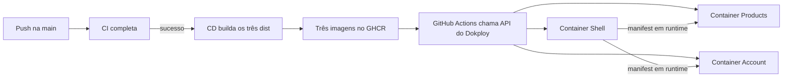

# Experimento 04 — CD real com GitHub Actions, GHCR e Dokploy

## Objetivo

Publicar Shell, Products e Account em três imagens independentes e fazer o
Dokploy atualizar somente a aplicação escolhida. O build pesado acontece no
runner do GitHub Actions; a VPS baixa a imagem pronta e a executa.

## Endereços públicos

| Aplicação | URL | Imagem |
| --- | --- | --- |
| Shell | `https://mfe.diidenis.com.br` | `ghcr.io/diidenis/microfrontends-lab-shell:main` |
| Products | `https://products-mfe.diidenis.com.br` | `ghcr.io/diidenis/microfrontends-lab-products:main` |
| Account | `https://account-mfe.diidenis.com.br` | `ghcr.io/diidenis/microfrontends-lab-account:main` |

## Fluxo



## Por que existe um Dockerfile de artefato pré-compilado

Os Dockerfiles da etapa 22 continuam úteis para o laboratório local: cada um
instala dependências, compila um app e cria sua imagem. Em produção, repetir
esse build na VPS consumiria CPU e memória e ainda exigiria que o registry npm
local estivesse acessível durante o build.

O CD resolve o problema em duas fases:

1. o runner inicia um Verdaccio efêmero, instala as versões imutáveis e gera
   cada `dist` com as URLs públicas corretas;
2. `infra/nginx/Dockerfile.prebuilt` apenas coloca um `dist` já aprovado dentro
   de uma imagem Nginx pequena.

O Verdaccio não fica publicado na internet e não é necessário durante o uso da
aplicação.

## URLs gravadas nos builds

O Shell recebe:

```text
PRODUCTS_REMOTE_URL=https://products-mfe.diidenis.com.br/mf-manifest.json
ACCOUNT_REMOTE_URL=https://account-mfe.diidenis.com.br/mf-manifest.json
```

Os remotes recebem seus próprios prefixos de assets:

```text
PRODUCTS_ASSET_PREFIX=https://products-mfe.diidenis.com.br/
ACCOUNT_ASSET_PREFIX=https://account-mfe.diidenis.com.br/
```

Por isso o navegador encontra o manifest, o `remoteEntry.js` e os chunks com
hash no domínio correto.

## Tags das imagens

Cada publicação mantém duas referências:

- `main`: ponteiro estável que o Dokploy acompanha;
- `sha-xxxxxxxxxxxx`: referência imutável ao commit, útil para auditoria e
  rollback manual.

Atualizar `main` não apaga a tag imutável anterior.

## Configuração externa

O workflow não versiona credenciais. Ele espera estas configurações no GitHub:

| Tipo | Nome | Uso |
| --- | --- | --- |
| Variable | `DOKPLOY_API_URL` | URL HTTPS do painel Dokploy |
| Variable | `DOKPLOY_SHELL_APPLICATION_ID` | ID da aplicação Shell |
| Variable | `DOKPLOY_PRODUCTS_APPLICATION_ID` | ID da aplicação Products |
| Variable | `DOKPLOY_ACCOUNT_APPLICATION_ID` | ID da aplicação Account |
| Secret | `DOKPLOY_API_TOKEN` | autenticação mínima para disparar deploy |

Sem essas configurações, o workflow publica as imagens e informa que o deploy
automático foi pulado. Isso permite fazer o primeiro bootstrap sem esconder uma
falha.

## Execução automática e manual

Um `push` na `main` dispara a CI. O CD só continua quando a execução da CI
termina com sucesso. A execução manual permite escolher `all`, `shell`,
`products` ou `account`, provando que cada imagem e deploy podem evoluir de
forma independente.

## Validações manuais

```powershell
curl.exe -I https://mfe.diidenis.com.br
curl.exe -I https://products-mfe.diidenis.com.br/mf-manifest.json
curl.exe -I https://account-mfe.diidenis.com.br/mf-manifest.json
```

Depois:

1. abrir `/`, `/products` e `/account` pelo domínio do Shell;
2. confirmar que o navegador busca os manifests nos dois subdomínios;
3. executar manualmente o CD com alvo `products`;
4. confirmar que somente o deploy de Products aparece no Dokploy;
5. verificar que o Shell já publicado continua carregando o remote.

## Resultado observado

Preencher depois do primeiro deploy real com os links das execuções, os
status HTTP, a versão visível de cada remote e qualquer correção necessária.

## Erros comuns

- gravar `localhost` no build de produção;
- expor o Verdaccio anônimo publicamente;
- disparar deploy antes de a CI terminar;
- usar uma URL HTTP para transmitir uma chave da API;
- dar cache longo ao `mf-manifest.json`;
- configurar o domínio do container na porta de build em vez da porta `80` do
  Nginx;
- tratar a tag mutável `main` como evidência suficiente para rollback.

## Perguntas de revisão

1. Por que a VPS não precisa de Node, pnpm ou Verdaccio durante a execução?
2. Qual é a diferença entre a tag `main` e a tag `sha-*`?
3. Por que o CD depende do sucesso da CI, mas continua sendo outro workflow?

## Exercício manual

Altere somente o texto de versão de Products, execute o CD manual com alvo
`products` e confirme que Shell e Account não recebem novos deploys.

## Como explicar o fluxo em até 90 segundos

> A CI valida packages, remotes, Shell e o E2E. Somente depois de uma execução
> bem-sucedida na main, o CD recria o registry efêmero, gera cada build com os
> domínios públicos e empacota três imagens Nginx independentes. O GitHub
> Actions publica as imagens no GHCR com uma tag estável e outra ligada ao SHA
> do commit. Em seguida chama a API HTTPS do Dokploy, que apenas baixa e executa
> a imagem pronta, reduzindo o uso de recursos da VPS. O Shell continua
> resolvendo Products e Account por manifests em runtime, então também posso
> publicar manualmente somente um remote sem recompilar o host.
