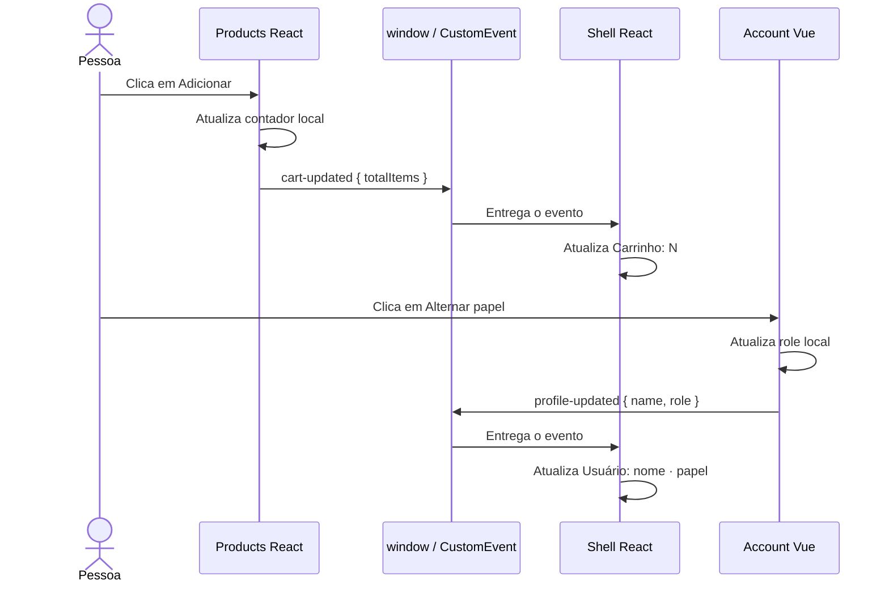

# Etapa 12 — Comunicação entre micro frontends com Custom Events

## O que foi criado

Foram implementados dois fluxos de comunicação em runtime:

- Products emite `mfe-lab:cart-updated` com o total de itens;
- Account emite `mfe-lab:profile-updated` com nome e papel;
- o shell escuta os dois eventos e mostra a última informação recebida no header.

Os nomes e payloads vêm de `@mfe-lab/contracts`. Nenhum app importa o estado interno de outro, e nenhum store global ou event bus de framework foi criado.

## Por que foi criado

Compor interfaces não faz os micro frontends conversarem automaticamente. Depois de carregar Products e montar Account dentro do shell, ainda faltava um canal explícito para comunicar pequenas mudanças relevantes à experiência geral.

Custom Events funcionam aqui como mensagens do navegador. O producer publica um fato que aconteceu, e o shell decide como reagir sem conhecer hooks React, refs Vue ou detalhes dos stores internos.

## Fluxo de execução



1. O shell registra os listeners uma vez quando `App` monta.
2. Ao montar, cada remote emite seu estado inicial para sincronizar o header.
3. Products continua mantendo `addedItems` em seu próprio `useState`.
4. Quando o total muda, Products cria `CustomEvent<CartUpdatedEventPayload>` e o despacha em `window`.
5. Account continua mantendo `role` em seu próprio `ref`.
6. O `watch` do Vue emite `CustomEvent<ProfileUpdatedEventPayload>` no estado inicial e nas alterações.
7. O shell recebe `event.detail` e atualiza somente sua representação no header.
8. Quando o shell desmonta, o cleanup do `useEffect` remove os listeners.

## Fonte da verdade e cópia de leitura

Products é a fonte da verdade do contador nesta demonstração. O número guardado no shell não permite adicionar ou remover itens; ele é somente a última fotografia anunciada por Products para apresentação no header.

Account é a fonte da verdade do papel. O shell não altera o `ref` do Vue: recebe apenas a última mensagem de perfil.

```text
Products: estado real do contador ── evento ──► Shell: cópia para exibição
Account:  estado real do perfil   ── evento ──► Shell: cópia para exibição
```

## Contrato TypeScript e contrato runtime

`@mfe-lab/contracts` fornece o vocabulário comum:

- `LAB_EVENT_NAMES` evita que cada app invente uma string diferente;
- `CartUpdatedEventPayload` define `{ totalItems: number }`;
- `ProfileUpdatedEventPayload` define `{ name, role }`.

O tipo genérico de `CustomEvent` ajuda durante o desenvolvimento, mas desaparece do JavaScript. O evento real e seu `detail` existem em runtime; a interface TypeScript não impede que um script externo dispare um payload inválido.

Por isso, Custom Events são um contrato runtime simples, não uma solução universal. Quando a origem dos dados não é confiável, validação runtime pode ser necessária. Quando o dado precisa sobreviver a recarregamentos, ser auditável ou ser compartilhado entre dispositivos, o backend normalmente é a fonte adequada.

## Cleanup dos listeners

O shell registra funções nomeadas dentro de um `useEffect` e retorna um cleanup que usa exatamente as mesmas referências em `removeEventListener`.

Sem cleanup, remontagens poderiam acumular listeners. Um único evento passaria a atualizar o shell várias vezes, criando consumo desnecessário, comportamentos duplicados e vazamento de memória.

## Comparação dos canais de comunicação

| Canal | Melhor uso | Vantagem | Limitação |
| --- | --- | --- | --- |
| Props e callbacks | Host monta diretamente uma interface e existe relação pai-filho | Explícito e fácil de seguir | Cria uma ligação direta entre montador e montado |
| Custom Events | Notificações pequenas entre partes no mesmo documento | Independente de React ou Vue | Pode ficar difícil de rastrear se houver eventos demais |
| URL | Estado navegável, filtros, rota e identificadores compartilháveis | Sobrevive a refresh e permite deep link | Não serve para dados privados ou mudanças muito frequentes |
| Backend | Dados de negócio duráveis e multiusuário, como carrinho real e autenticação | Fonte central, persistente e auditável | Exige rede, API e tratamento de consistência |
| Estado global compartilhado | Estado de interface muito coordenado na mesma página | Atualização reativa e direta | Aumenta acoplamento de runtime, versão e ownership |

Neste laboratório, props já são usadas para iniciar Account, e Custom Events devolvem notificações ao shell. Em um produto real, quantidade e conteúdo do carrinho provavelmente seriam persistidos pelo backend; o evento do navegador serviria para avisar a interface de que uma nova leitura pode ser necessária.

## Arquivos importantes

- `packages/contracts/src/index.ts`: nomes e formatos compartilhados.
- `apps/products-react/src/ProductApp.tsx`: estado local e emissão do carrinho.
- `apps/account-vue/src/AccountApp.vue`: estado local e emissão do perfil.
- `apps/shell-react/src/App.tsx`: listeners, cleanup e apresentação no header.
- `apps/shell-react/src/browser-events.d.ts`: associação tipada entre nomes de evento e `WindowEventMap`.

## Comandos

```powershell
pnpm run typecheck
pnpm run build
pnpm run dev
```

## Como validar

1. Execute `pnpm run dev` e abra `http://localhost:3000`.
2. Entre em `/products` e confirme `Carrinho: 0`.
3. Clique duas vezes em `Adicionar` e confirme `Carrinho: 2` no header.
4. Vá para `/account` e confirme `Usuário: Denis · Administrador`.
5. Clique em `Alternar papel` e confirme `Usuário: Denis · Operador`.
6. Navegue várias vezes entre as rotas. Cada clique deve produzir somente uma transição visível, sem listeners ou montagens duplicadas.
7. Saia de Products e volte. Como seu estado é local, ele reinicia e anuncia `Carrinho: 0`.
8. Execute `pnpm run typecheck` e `pnpm run build`.

## Erros comuns

- Importar o hook, store ou `ref` interno de outro micro frontend.
- Escrever o nome do evento manualmente em vários apps e gerar divergência por digitação.
- Enviar um payload diferente daquele definido no contrato.
- Registrar listeners a cada render ou esquecer o cleanup.
- Remover o listener usando uma nova função, diferente da referência registrada.
- Usar Custom Events como banco de dados ou fonte persistente de negócio.
- Criar um event bus sofisticado antes de existir necessidade real.
- Acreditar que o tipo TypeScript valida mensagens em runtime.

## Perguntas de revisão

1. Quem é a fonte da verdade do contador nesta demonstração?
2. Por que o shell escuta um evento em vez de importar o store de Products?
3. Em um sistema real, quais dados deveriam estar no backend em vez do browser?

## Exercício manual

Com os três apps em execução, abra o console do navegador na página do shell e dispare:

```javascript
window.dispatchEvent(
  new CustomEvent('mfe-lab:cart-updated', {
    detail: { totalItems: 7 },
  }),
);
```

Confirme que o header mostra `Carrinho: 7`. Depois entre novamente em Products e observe que ele anuncia seu próprio estado local. Isso evidencia tanto o canal runtime quanto a ausência de validação automática do TypeScript no console.

## Explicação de entrevista em até 90 segundos

Neste laboratório, cada micro frontend continua dono de seu estado: Products controla o contador e Account controla o perfil. Para atualizar informações globais do layout, eles disparam Custom Events no `window`. Os nomes e payloads vêm de um pacote TypeScript framework-agnostic, então React e Vue compartilham o mesmo vocabulário sem compartilhar implementação ou store. O shell registra listeners em um `useEffect`, lê o `detail`, mantém apenas uma cópia para exibição e remove os listeners no cleanup. É uma solução simples para poucas notificações dentro da mesma página, mas não substitui backend, persistência ou uma estratégia de estado mais coordenada. Além disso, TypeScript ajuda no build, porém não valida sozinho um evento recebido em runtime.
