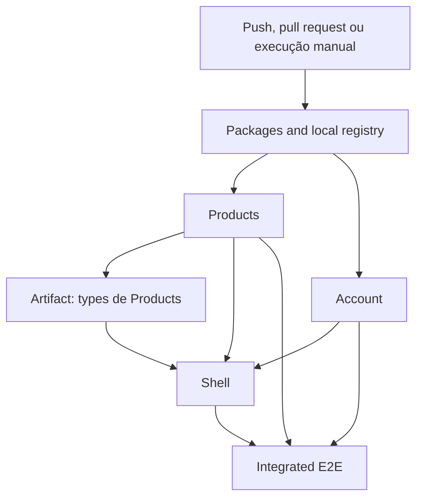

# Etapa 23 — CI e ownership

## O que foi criado

Foi criado um workflow de GitHub Actions que valida o laboratório em `push`, `pull_request` e execução manual. Ele apresenta cinco nomes claros na interface:

```text
Packages and local registry
Products
Account
Shell
Integrated E2E
```

Products e Account são duas execuções da mesma matriz, mas aparecem como jobs independentes. O workflow instala Node `24.18.0` e pnpm `11.21.0`, usa lockfile congelado, cria um Verdaccio efêmero em cada runner e não realiza deploy.

Também foram criados:

- verificação dos pacotes instalados por versão e caminho real;
- instalação completa do workspace ao final do `bootstrap:local`;
- passagem dos tipos remotos de Products para o Shell como artifact;
- seed imutável de `ui-react@1.0.0` para registries vazios;
- cache somente do store do pnpm.

## Por que foi criado

Deploy independente não significa integrar somente no computador de cada equipe. Products pode passar sozinho e ainda quebrar o Shell por remover um expose, alterar props, mudar evento ou publicar tipos incompatíveis.

A CI cria duas perspectivas complementares:

```text
validação por domínio → localiza quem falhou
teste integrado       → verifica se todos ainda colaboram
```

## Vocabulário mínimo de GitHub Actions

### Workflow

É o arquivo YAML que descreve quando e como a automação será executada.

### Runner

É a máquina temporária fornecida ao job. Cada job recebe um filesystem e processos próprios.

### Job

É uma unidade de execução isolada. `needs` define ordem e dependência entre jobs, mas não compartilha arquivos automaticamente.

### Step

É uma ação ou comando dentro de um job, como checkout, instalação, build ou teste.

### Matrix

Executa a mesma receita para valores diferentes. A matriz de remotes evita copiar o mesmo YAML, mas mostra `Products` e `Account` separadamente.

### Artifact

É um arquivo produzido por um job e transferido pela infraestrutura do GitHub para outro. Nesta etapa, o zip de tipos de Products cruza a fronteira até o job Shell.

### Cache

É uma otimização descartável. O store do pnpm pode evitar downloads repetidos, mas a pipeline precisa funcionar mesmo sem cache.

## Fluxo da pipeline



`fail-fast: false` faz Products e Account terminarem suas próprias validações mesmo que um deles falhe. Assim, a tela da Action consegue mostrar se o problema pertence a um ou aos dois remotes.

## Por que cada job cria outro Verdaccio

Os jobs do GitHub não compartilham containers nem disco. Quando o job Packages termina, seu Verdaccio desaparece junto com o runner. O job Products recebe outra máquina e precisa repetir o bootstrap.

No laboratório isso custa repetição, mas torna a execução fiel e compreensível. Em uma empresa, versões aprovadas normalmente já estariam num registry persistente, e os jobs consumidores apenas fariam a instalação autenticada.

Nenhum storage do Verdaccio entra no cache. Cachear esse banco mutável esconderia versões ausentes e transformaria uma otimização em fonte da verdade.

## Como o bootstrap funciona numa máquina limpa

```text
inicia Verdaccio vazio
        ↓
instala ferramentas dos packages
        ↓
builda e inspeciona os tarballs
        ↓
publica versões no Verdaccio
        ↓
instala o workspace completo com frozen lockfile
        ↓
verifica versões e caminhos instalados
```

Antes desta etapa, o último passo instalava somente `apps/*`. Isso funcionava na máquina já preparada, mas deixaria Vitest e Playwright ausentes numa CI limpa. Agora `workspace:install:local-registry` instala a raiz, os apps e os packages depois que o registry foi abastecido.

## O problema da versão histórica

O Shell usa `@mfe-lab/ui-react@1.0.0`, e Products usa `1.1.0`. O código-fonte atual da biblioteca só pode produzir honestamente `1.1.0`.

Um registry real guarda publicações antigas. Um Verdaccio efêmero não guarda nada. Por isso `infra/verdaccio/seed/ui-react-1.0.0` contém o artifact imutável publicado na etapa 16:

```text
seed 1.0.0        → histórico, não é editado como fonte atual
packages/ui-react → fonte atual 1.1.0
```

O seed não é cache do storage. Ele é uma entrada versionada e revisável necessária para reproduzir o histórico do experimento.

## Como provamos que não são links de workspace

`linkWorkspacePackages: false` impede que uma versão comum nos apps seja silenciosamente conectada à pasta fonte. O script de verificação faz três checagens por dependência:

1. lê a versão do `package.json` efetivamente instalado;
2. resolve o caminho real e rejeita qualquer caminho dentro de `packages/*`;
3. exige resolução sob `node_modules/.pnpm/@mfe-lab+...` e confirma a versão no Verdaccio atual.

Isso também protege a diferença intencional entre Shell `ui-react@1.0.0` e Products `ui-react@1.1.0`.

## Tipos remotos entre jobs

O job Products gera `dist/@mf-types.zip`. Como o job Shell não herda o disco de Products, o zip é enviado como artifact e extraído em:

```text
apps/shell-react/@mf-types/products
```

Depois disso, o TypeScript valida `products/ProductApp`. O build isolado do Shell usa `MF_CONSUME_REMOTE_TYPES=false` somente para não tentar baixar novamente os mesmos tipos de um servidor que não está ativo naquele job.

No E2E, os três servidores são iniciados e a integração dinâmica completa continua sendo testada.

## Cache de pnpm

`actions/setup-node` usa o hash de `pnpm-lock.yaml` para armazenar o store global do pnpm. Não são cacheados:

- `node_modules`;
- pastas `dist`;
- dados do Verdaccio;
- resultado dos testes como fonte de verdade.

Se o cache desaparecer, `pnpm install --frozen-lockfile` baixa tudo novamente e deve produzir o mesmo resultado.

## Actions fixadas e permissões

Checkout, Node, pnpm e transferência de artifacts estão fixados por SHA completo, com a versão humana num comentário. Isso evita que uma tag móvel altere silenciosamente o código executado.

O workflow declara somente:

```yaml
permissions:
  contents: read
```

Não existem secrets, login em npm, Docker Hub ou permissão de escrita. As publicações acontecem apenas no Verdaccio descartável do próprio job.

## Ownership por domínio

Um exemplo de divisão de responsabilidade:

| Domínio | Responsabilidade principal | Validação isolada |
| --- | --- | --- |
| Plataforma | Shell, composição e pipeline | job Shell |
| Produtos | `ProductApp`, catálogo e evento de carrinho | job Products |
| Conta | lifecycle Vue, usuário e papel | job Account |
| Base compartilhada | contracts, tokens e bibliotecas | job Packages |
| Sistema | experiência composta | job Integrated E2E |

Ownership não quer dizer “ninguém mais precisa validar”. Uma alteração em contratos, tokens ou bibliotecas compartilhadas pode impactar todos os consumidores.

## Por que não usamos filtros de paths

Não há filtros nesta etapa. Uma mudança aparentemente restrita a `packages/contracts` pode quebrar os três apps; uma mudança em configuração do Shell pode quebrar o E2E; uma mudança de remote pode quebrar a composição.

Filtros só seriam seguros com um grafo de dependências completo e regras testadas. Economizar minutos ignorando consumidores afetados produziria falso positivo de segurança.

## Pipeline independente versus teste integrado

O job individual responde:

> “Meu domínio compila e passa no typecheck?”

O E2E responde:

> “O usuário consegue atravessar a composição com todos os domínios juntos?”

Nenhum dos dois substitui o outro. Um teste integrado único localiza mal a origem da falha; apenas testes independentes podem deixar incompatibilidades runtime passarem.

## Arquivos importantes

- `.github/workflows/ci.yml`: gatilhos, jobs, ordem e comandos da CI.
- `scripts/verify-registry-packages.mjs`: prova versões e origem instalada.
- `scripts/publish-local-packages.mjs`: publica as versões necessárias em ordem.
- `infra/verdaccio/seed/ui-react-1.0.0`: snapshot histórico para registry vazio.
- `package.json`: bootstrap completo e comandos de verificação.
- `pnpm-workspace.yaml`: mantém links automáticos de workspace desabilitados.

## Comandos

Equivalentes locais principais:

```powershell
pnpm run bootstrap:local
pnpm run packages:verify:registry
pnpm run packages:pack:check
pnpm run check:all
```

Validação do YAML com o actionlint oficial, sem instalar pacote no projeto:

```powershell
docker run --rm `
  -v "D:\denis_estudos\microfrontends-lab:/repo" `
  --workdir /repo `
  rhysd/actionlint:1.7.12 `
  .github/workflows/ci.yml
```

## Como validar no GitHub

1. Crie o repositório no GitHub.
2. Adicione o remote e envie o commit que contém o workflow.
3. Abra a aba Actions e selecione `CI`.
4. Confirme os jobs Packages, Products, Account, Shell e Integrated E2E.
5. Abra cada job para relacionar steps e comandos.
6. Confirme que nenhum step publica externamente ou faz deploy.

## Resultado observado localmente

Em 14 de setembro de 2026:

- `bootstrap:local` executou com lockfile congelado;
- os dez vínculos de pacotes dos apps apontaram para o store do pnpm, não para `packages/*`;
- um Verdaccio temporário vazio recebeu as cinco publicações, incluindo `ui-react@1.0.0` e `1.1.0`;
- o container e o volume temporários foram removidos após o teste;
- os tipos gerados por Products foram extraídos num Shell sem seus tipos anteriores;
- typecheck e build do Shell passaram usando o artifact transferido;
- actionlint `1.7.12` aprovou o workflow sem erros;
- os comandos equivalentes completos passaram localmente.

A execução hospedada ainda depende do primeiro push para o repositório que será criado pelo aluno.

## Erros comuns

- imaginar que `needs` compartilha `node_modules` ou arquivos entre jobs;
- manter `ui-react@1.0.0` somente num volume local que a CI não possui;
- cachear o storage do Verdaccio e esconder ausência de versões;
- usar `pnpm install` sem `--frozen-lockfile` na CI;
- executar somente E2E e perder ownership da falha;
- executar somente builds isolados e não testar composição runtime;
- publicar no npm por engano em vez do registry efêmero;
- usar secret ou permissão de escrita sem necessidade;
- aplicar filtros de paths sem mapear dependências compartilhadas;
- acreditar que deploy independente elimina compatibilidade entre producer e consumer.

## Perguntas de revisão

1. Por que cada job precisa de um novo Verdaccio mesmo usando `needs`?
2. Qual é a diferença entre cache do pnpm e artifact de tipos de Products?
3. Por que uma alteração em `contracts` deve validar vários consumidores?

## Exercício manual

Troque temporariamente a versão esperada de `ui-react` para `9.0.0` em uma entrada de `verify-registry-packages.mjs`, execute `pnpm run packages:verify:registry` e observe a mensagem que identifica o app e pacote incompatíveis. Depois restaure a versão correta.

## Explicação de entrevista em até 90 segundos

Estruturei uma CI por ownership: packages, Products, Account e Shell têm validações identificáveis, seguidas por um E2E integrado. Cada job roda numa máquina isolada, então recria um Verdaccio efêmero, publica os pacotes locais e instala tudo com lockfile congelado. Um script resolve os caminhos reais e prova que os apps usam artifacts do registry, não links de workspace. O cache contém somente o store descartável do pnpm; nunca o storage mutável do registry. Products entrega seus tipos federados ao Shell como artifact entre jobs, pois `needs` ordena, mas não compartilha filesystem. Contracts e tokens disparam validações amplas porque têm vários consumidores. A pipeline não possui secrets, permissão de escrita, publicação externa nem deploy. Assim, mantenho feedback isolado por domínio e uma prova final da composição runtime.

## Referências oficiais consultadas

- [GitHub Actions — Understanding GitHub Actions](https://docs.github.com/en/actions/get-started/understand-github-actions)
- [GitHub Actions — Using jobs](https://docs.github.com/en/actions/how-tos/write-workflows/choose-what-workflows-do/use-jobs)
- [GitHub Actions — Workflow syntax](https://docs.github.com/en/actions/reference/workflows-and-actions/workflow-syntax)
- [GitHub Actions — Dependency caching](https://docs.github.com/en/actions/reference/workflows-and-actions/dependency-caching)
- [GitHub Actions — Secure use](https://docs.github.com/en/actions/reference/security/secure-use)
- [setup-node — pnpm cache](https://github.com/actions/setup-node/blob/main/docs/advanced-usage.md)
- [actionlint — Usage](https://github.com/rhysd/actionlint/blob/main/docs/usage.md)
